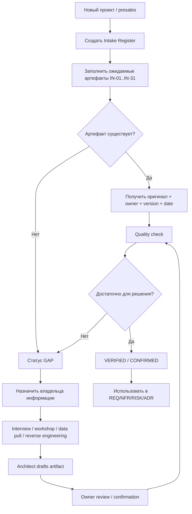

# Lesson 01 — Architect Intake Pack

## Назначение

Этот документ задаёт **идеальный входной пакет архитектора** и процесс получения недостающей информации.

Материал OTUS для урока 1 прямо рассматривает работу архитектора от «идеи на салфетке» до формального ТЗ, RFP, выявления скрытых требований и выбора коммерческой модели. Этот Intake Pack — расширение практики: он описывает, какие входные артефакты архитектор должен запросить, проверить и, при отсутствии, организовать их создание.

## Главный принцип

> Архитектор не ждёт идеального ТЗ. Он отвечает за то, чтобы для значимых архитектурных решений существовал достаточный и проверяемый вход.

Если документ отсутствует, архитектор:

1. фиксирует `GAP`;
2. определяет владельца информации;
3. запрашивает исходные данные;
4. при необходимости создаёт первый черновик сам;
5. проводит workshop/interview/review;
6. получает подтверждение владельца;
7. фиксирует источник, дату и версию;
8. только после этого использует материал как основание для архитектурного решения.

Нельзя незаметно превращать предположение архитектора в факт проекта.

---

## Статусы входного артефакта

- `EXPECTED` — документ должен существовать, проверка ещё не началась.
- `REQUESTED` — запрос отправлен владельцу.
- `RECEIVED` — материал получен, но ещё не проверен.
- `VERIFIED` — источник, версия, полнота и применимость подтверждены.
- `GAP` — материала нет или он недостаточен.
- `DRAFTED_BY_ARCHITECT` — архитектор создал рабочий черновик из интервью/наблюдений/доступных данных.
- `CONFIRMED` — черновик согласован владельцем предметной области.
- `WAIVED` — документ признан неприменимым; причина зафиксирована.
- `SUPERSEDED` — заменён новой версией.

---

## Реестр входных документов

| ID | Входной артефакт | Кто обычно владелец | Как получить | Что проверить | Если отсутствует | Что получает архитектор |
|---|---|---|---|---|---|---|
| IN-01 | Product Vision / Vision Statement | Sponsor / Product Owner | интервью + существующие презентации/стратегия | проблема, целевой пользователь, результат, границы | провести Vision Workshop и оформить 1-page Vision | `BUS`, цели, границы |
| IN-02 | Business Need / Problem Statement | Sponsor / бизнес-владелец | интервью, KPI, проблемные отчёты | проблема измерима? кто страдает? почему сейчас? | составить Problem Statement и подтвердить у sponsor | исходная бизнес-потребность |
| IN-03 | Business Case | Sponsor / Finance / Product | финансовая модель, бюджет, инвестиционный комитет | выгоды, стоимость, риски, альтернативы, горизонт | сделать черновой value/cost case с явными assumptions | экономика решения |
| IN-04 | Stakeholder Register | Sponsor / PM / PO | оргструктура, интервью, RACI | кто принимает, использует, эксплуатирует, регулирует | построить Stakeholder Map и валидировать на kick-off | владельцы требований и решений |
| IN-05 | Scope / Out of Scope | PO / PM / Sponsor | charter, договор, backlog, workshop | границы продукта, MVP, этапы, исключения | провести Scope Workshop; создать scope baseline | границы архитектуры |
| IN-06 | Business Requirements | Business Owner / BA | BRD/БФТ, интервью, процессы | связь с бизнес-целями, источник, приоритет | architect + BA формируют draft и отдают бизнесу на review | `REQ-BUS` |
| IN-07 | Stakeholder Requirements | BA / пользователи / SME | интервью, workshop, observation | чей requirement, конфликт интересов, приоритет | интервью по ролям + сценариям | `REQ-STK` |
| IN-08 | Functional Requirements | BA / PO | SRS, backlog, use cases | полнота сценариев, исключения, данные, ошибки | use-case workshop + event/scenario decomposition | `REQ-FUNC` |
| IN-09 | NFR / Quality Attributes | Architect + владельцы NFR | SRS, SLA, security policy, ops metrics | измеримость: latency, availability, scale, security и др. | архитектор обязан сформировать NFR catalogue и согласовать | `NFR` / архитектурные драйверы |
| IN-10 | Acceptance Criteria | PO / QA / Business | user stories, Definition of Done, UAT plan | проверяемость, однозначность, связь с requirement | architect/BA/QA готовят критерии и получают согласование | будущие `TEST` |
| IN-11 | Personas / User Journeys / Use Cases | UX / PO / BA | исследования, интервью, analytics | реальные роли, частота, критические пути | workshop + интервью + наблюдение | сценарии нагрузки и UX constraints |
| IN-12 | Business Processes / BPMN | Process Owner / BA | регламенты, BPMN, интервью | AS-IS/TO-BE, ручные шаги, исключения | процессное интервью; архитектор рисует черновик | контекст интеграций и automation |
| IN-13 | Domain Model / Glossary | SME / BA / Data Owner | словари, регламенты, схемы данных | термины однозначны? сущности и правила понятны? | domain workshop + glossary | модель предметной области |
| IN-14 | AS-IS Architecture | Enterprise/Solution Architect / IT | C4, Visio, CMDB, repo, network diagrams | актуальность, владельцы, версии, реальные зависимости | reverse engineering: интервью + repo + CMDB + runtime evidence | ограничения legacy и точки интеграции |
| IN-15 | Integration Inventory | Integration Architect / владельцы систем | API catalogue, OpenAPI, broker topics, contracts | протокол, auth, SLA, ownership, versioning | discovery интеграций и API inventory | внешние зависимости |
| IN-16 | Data Inventory / Data Dictionary | Data Owner / DBA / Data Architect | ERD, DWH catalogue, schemas, samples | owner, sensitivity, quality, volume, retention | data profiling + interviews; черновой data catalogue | `DATA` и privacy constraints |
| IN-17 | Security & Compliance Requirements | CISO / ИБ / Legal / DPO | политики, threat model, законы, стандарты | применимость, обязательность, класс данных | security workshop + applicability matrix | `CTRL`, security constraints |
| IN-18 | IAM Model | IAM / ИБ / Platform | RBAC/ABAC docs, IdP, SSO/OIDC/SAML contracts | actors, roles, service accounts, privileged access | access matrix workshop | identity boundaries |
| IN-19 | SLA / SLO / Support Model | Operations / Service Owner | SLA, monitoring dashboards, incident stats | p95/p99, availability, support hours, escalation | SLO workshop на основе business criticality | измеримые эксплуатационные NFR |
| IN-20 | Load Profile / Capacity Data | Product Analytics / Ops | RPS/TPS, concurrency, DAU/MAU, storage growth | средняя/пиковая нагрузка, сезонность, рост | построить assumptions + synthetic load profile | вход для sizing |
| IN-21 | Infrastructure / Platform Constraints | Platform / DevOps / Cloud Team | cloud landing zone, CMDB, quotas, standards | регионы, quotas, сети, runtime, approved services | platform interview + environment inventory | технические constraints |
| IN-22 | Delivery Plan / Roadmap | PM / PO / Engineering Manager | roadmap, milestones, release plan | сроки, зависимости, критический путь | architect участвует в decomposition и техническом roadmap | временные constraints |
| IN-23 | Team & Skills Matrix | Engineering Manager | staffing plan, competency matrix | реальные компетенции, availability, bus factor | интервью с EM/tech leads | feasibility и maintainability constraints |
| IN-24 | Budget / Commercial Model | Sponsor / Finance / Sales | бюджет, contract, proposal, procurement docs | CAPEX/OPEX, лимиты, валюта, лицензии, условия | architect формирует cost assumptions и просит подтверждение | `COST` constraints |
| IN-25 | RFI / RFP / RFQ / SOW / Contract | Procurement / Sales / Client | закупочный пакет | scope, deliverables, acceptance, liabilities, change rules | architect делает requirements/questions matrix | юридические/коммерческие рамки |
| IN-26 | Risk Register | PM / Risk / Security / Architect | проектный risk register, audit findings | probability, impact, owner, mitigation | architect создаёт technical risk register | `RISK` |
| IN-27 | Assumption Log | Architect / PM / BA | workshops, estimates, ADR drafts | каждое предположение имеет owner и validation trigger | архитектор создаёт сам с первого дня | явная неопределённость |
| IN-28 | Open Questions / Decision Log | Architect / PM | meeting notes, issue tracker | owner, due date, blocking/non-blocking | architect ведёт Questions Log | управляемые `GAP` |
| IN-29 | Existing ADR / Decision History | Architecture Board / Teams | repo, wiki, minutes | почему решение принято, ещё действует? | восстановить decision history из git/интервью и явно пометить confidence | исходные ограничения решений |
| IN-30 | Incidents / Postmortems / Problem Reports | SRE / Ops / Support | incident tracker, postmortems | recurring failures, SLO breaches, root causes | interview + metrics review | реальные архитектурные pain points |
| IN-31 | PoC / Benchmark / Research Evidence | R&D / Team / Vendors | reports, notebooks, test runs | сравнивались ли одинаковые условия? воспроизводимо? | architect задаёт experiment plan | доказательства для trade-offs |

---

## Процесс получения входа

---

## Как архитектор проверяет качество входного документа

Минимум у каждого критичного входа должны быть:

- владелец (`owner`);
- источник;
- дата получения;
- версия;
- область применимости;
- статус согласования;
- известные пробелы;
- assumptions;
- противоречия с другими источниками;
- ссылки на связанные требования/риски/решения.

### Красные флаги

- «все и так знают, что имеется в виду»;
- документ без владельца;
- документ без даты/версии;
- цифры нагрузки без периода и методики;
- SLA без измерения и источника метрик;
- «обязательно Kubernetes/AI/blockchain» без сформулированной потребности;
- коммерческий срок, не связанный с scope;
- security requirement в виде «система должна быть безопасной»;
- архитектурная схема, не совпадающая с runtime;
- предположение, записанное как факт.

---

## Что архитектор создаёт сам в первые дни

Даже при хорошем входном пакете архитектор ведёт собственные рабочие артефакты:

1. `INTAKE_REGISTER` — что получили и чего нет.
2. `QUESTIONS_LOG` — уточняющие вопросы, owner, deadline.
3. `ASSUMPTION_LOG` — что пока принято без доказательства.
4. `CONSTRAINT_REGISTER` — ограничения бизнеса, техники, права, времени и денег.
5. `RISK_REGISTER` — архитектурные и технические риски.
6. `NFR_CATALOGUE` — измеримые quality attributes.
7. `STAKEHOLDER_MAP` — кто принимает и кто владеет concerns.
8. `SCOPE_BASELINE` — in/out of scope.
9. `AS_IS_MAP` — существующая система и зависимости.
10. `DECISION_BACKLOG` — какие ADR предстоит принять.

---

## Сквозная трассировка

Идеальный путь одного решения:

`SOURCE → INPUT → REQUIREMENT/NFR → RISK/CONSTRAINT → OPTION → ADR → COMPONENT → TEST → SLO → COST → RELEASE`

Если нельзя показать источник важного требования или основания решения, это не доказанная архитектура, а гипотеза, которую надо пометить и проверить.
