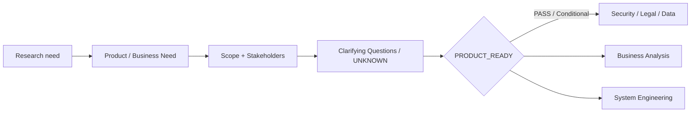

# OTUS Lesson 01 — FATHER OSINT Agent / Presale & Requirements Foundation

**Project:** `VictorKVS/OSINT_deepseek`  
**Mode:** one living project across Lessons 01–20  
**Status:** `CONDITIONAL_PASS / RETROSPECTIVE_RECONSTRUCTION`

## What this lesson adds to the real project

Lesson 01 is treated as the missing upstream documentation layer for the existing OSINT Agent. The implementation is not changed here. We reconstruct and formalize the product/presale inputs that should have existed before technical design.

## Project problem

The OSINT worker exists to reduce repeated manual research, preserve provenance of collected material and return bounded evidence packages to Analyst. It is not a truth engine, does not autonomously publish knowledge and must not replace accountable analytical review.

## Product / presale package

The project-level package contains:

- Business Need;
- Product Vision;
- Stakeholders and Decision Authority;
- Scope / Out of Scope;
- Success Metrics;
- Assumption / UNKNOWN Log;
- Product Ready Decision;
- RFP / clarification-question model for future external work.

Canonical project package:

`OSINT_deepseek/docs/course_live_reproduction/01_product/`

Canonical project repository branch:

`feature/otus-live-reproduction-01-20`

## Main product chain



## What is supported by existing repository evidence

The existing OSINT repository already supports the following facts:

- bounded `ResearchTask` input;
- structured `MaterialPackage` output;
- provenance preservation;
- explicit collector errors/gaps;
- bounded research loops;
- separation between OSINT, Analyst and Socrates/reviewer;
- DEV scope is distinct from future Production scope;
- architecture/test/verification evidence already exists downstream.

## What remains UNKNOWN

- external commercial target segment;
- product/business KPI baseline;
- named Legal/Compliance authority for Production;
- Production data classification and retention rules;
- Production workload/SLO targets;
- approved LLM hosting strategy;
- Production budget/TCO envelope.

Unknown means `UNKNOWN`, not "not applicable" and not a reason to invent a number.

## Gate

```text
PRODUCT_READY = CONDITIONAL_PASS
```

Reason: product intent, scope and role boundaries are evidenced, while Production/commercial parameters remain open and explicitly owned for later lessons.

## What should be improved

| Priority | Improvement | Target |
|---|---|---|
| P1 | Define product/business KPI baseline | Lessons 1–3 |
| P0 | Formalize legal/compliance applicability before Production live collection | Lessons 3–14 |
| P0 | Create Production data inventory/classification/retention rules | Lessons 12–14 |
| P2 | Keep explicit UNKNOWN panel at every gate | Lessons 1–20 |

## Source of truth

This OTUS file is a course mirror, not a second project truth source. Canonical engineering documents remain in `VictorKVS/OSINT_deepseek`, branch `feature/otus-live-reproduction-01-20`.
