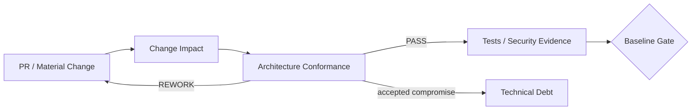

# OTUS Lesson 10 — FATHER OSINT Agent / Architectural Governance & Technical Debt

**Project:** `VictorKVS/OSINT_deepseek`  
**Status:** `CONDITIONAL_PASS / DOCUMENTATION LAYER`

## What the lesson asks

Build an architectural-governance process, review changes/PRs for conformance with approved architecture, and identify/manage technical debt through its lifecycle.

## How it is applied to the real OSINT project

The project already has requirements, ADRs, risk/security registers, DoR/DoD, Change Impact Analysis and a debt rule. Lesson 10 turns those controls into one compact conformance loop instead of creating a second governance system.



## Review dimensions

A material change is checked against:

- approved requirement/business outcome;
- C4/C3 boundaries and data contracts;
- provenance/data semantics;
- trust/security boundaries;
- dependencies/providers;
- operability/restart/rollback;
- test/verification obligations;
- ADR impact.

Possible outcomes:

`PASS / PASS_WITH_CONDITIONS / REWORK / ADR_REQUIRED / DEBT_ACCEPTANCE_REQUIRED / BLOCKED_BY_MISSING_EVIDENCE`.

## Technical debt

Current accepted compromises include:

1. local append-only JSONL/file persistence for DEV;
2. deterministic Analyst/Reviewer harnesses still colocated with OSINT core;
3. primarily Markdown/Mermaid architecture views with manual synchronization;
4. duplicated course-facing explanations in OTUS and project repositories.

These are not defects. They are accepted current compromises with repayment triggers.

Important distinction:

```text
DEFECT = approved contract is violated
RISK   = uncertain exposure may cause harm
DEBT   = known compromise accepted now
FEATURE = desired future capability
```

## What is not carried forward as debt

The historic provenance/dedup problem is not listed as debt because the current `MaterialStore` preserves source observations while reusing equal payloads.

## Result

`LESSON_10_GOVERNANCE = CONDITIONAL_PASS`

The governance model is documented and aligned with the project; automated PR/conformance enforcement is future work.

## What should be improved

| Priority | Improvement |
|---|---|
| P1 | generate C4/contract views from canonical models where useful |
| P1 | add automated checks for stable architectural invariants |
| P2 | generate OTUS mirrors automatically from canonical project artifacts |
| P2 | measure debt carrying cost from real operational telemetry |

Canonical pack: `OSINT_deepseek/docs/course_live_reproduction/10_architecture_governance/`.
