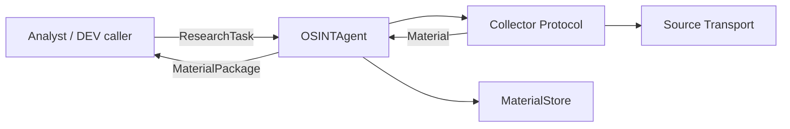
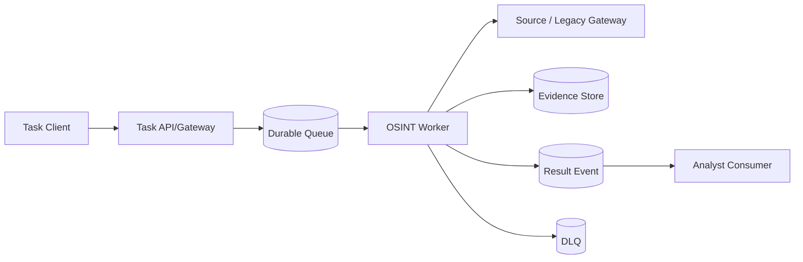

# OTUS Lesson 11 — FATHER OSINT Agent / Integration Architecture

**Project:** `VictorKVS/OSINT_deepseek`  
**Status:** `CONDITIONAL_PASS / DOCUMENTATION LAYER`

## What the lesson asks

Choose integration patterns/protocols appropriately, design resilient asynchronous integration and understand modern AI integration standards such as MCP/A2A while keeping compatibility with traditional systems.

## Current OSINT integration truth

Current DEV uses direct contracts because they are the smallest mechanism proving behavior. Telegram already has a transport-neutral boundary: `TelegramCollector` depends on `TelegramTransport`, so TDLib/GramJS/etc. can be swapped without changing the Analyst contract.

## Candidate Production async pattern

A message broker is introduced only if long-running work, durable buffering, replay, backpressure or independent worker scaling becomes a real requirement.

Required properties: task/trace identity, bounded retry, idempotency/duplicate handling, checkpoint-after-durable-save, backpressure, failure isolation, audit and explicit auth/data policy.

## Pattern applicability

| Mechanism | Use in OSINT project |
|---|---|
| HTTP/REST | candidate external task/status/result API |
| gRPC | candidate typed internal service boundary |
| Message Broker | candidate long-running/durable async work |
| ETL/ELT | batch/history/backfill/data preparation |
| MCP | future controlled model/agent tool boundary |
| A2A | future inter-agent protocol if agents become independent services |
| ONNX | model portability/deployment format; not the message bus |

## Main decision

Do not add broker/service mesh/MCP/A2A only because they exist. Selection order is:

`interaction need → reliability/security/data constraints → simplest adequate pattern → protocol/technology`.

## What remains UNKNOWN

- production task duration and concurrency;
- retry/replay/backlog SLO;
- external consumer requirements;
- broker retention/security requirements;
- whether separately deployed agents justify MCP/A2A.

## Result

`LESSON_11_INTEGRATION_ARCHITECTURE = CONDITIONAL_PASS`

## What should be improved

| Priority | Improvement |
|---|---|
| P1 | define production timeout/retry/replay/idempotency NFR |
| P1 | version event/message schemas if async path is promoted |
| P1 | add transport-adapter compatibility/contract tests |
| P1 | choose broker/API technology only after requirements/measurements |
| P0 | preserve auth/data/privilege context across MCP/A2A/tool boundaries |

Canonical pack: `OSINT_deepseek/docs/course_live_reproduction/11_integrations/`.
