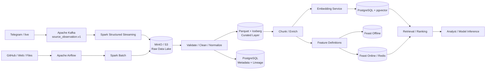

# OTUS Lesson 12 — FATHER OSINT Agent / Data Pipelines и интеграционные шлюзы

**Проект:** `VictorKVS/OSINT_deepseek`  
**Статус:** `READY FOR HOMEWORK REVIEW`  
**Формат:** схема + компактное описание целевой архитектуры. Реализация проекта в этом проходе не менялась.

## 1. Data Sources

Вместо отдельного учебного ритейл-кейса используется тот же сквозной FATHER OSINT Agent.

| Источник | Тип | Роль |
|---|---|---|
| Telegram / live feeds | **streaming** | новые сообщения и обновления почти в реальном времени |
| GitHub / Web / RSS | **micro-batch / polling** | периодическое получение новых/изменённых материалов |
| PDF / DOCX / media / uploads | **batch/event** | документы и исходные файлы с сохранением оригинала |
| Eval / Golden datasets | **batch** | воспроизводимое обучение/оценка retrieval, ranking и LLM-компонентов |

## 2. Pipeline Design

Для целевой Production-кандидатной архитектуры используется **hybrid Lambda/Kappa**: streaming-ветка строится вокруг append-only event log и replay, batch/historical ветка — вокруг Data Lake. Оба пути сходятся в единую raw/curated модель.



### Где очистка

Очистка выполняется **после raw landing**. Оригинал сохраняется неизменяемым вместе с hash/provenance, а уже затем создаётся normalized/curated representation. Это позволяет повторно обработать исходник новым parser/cleaner без потери evidence.

### Где создаются embeddings

После цепочки:

`raw → validate → normalize → chunk → enrich → embedding`.

Для embedding фиксируются `chunk_id`, `embedding_model/version`, `transform_version` и ссылка на исходный raw object. Vector index является производным и может быть перестроен.

## 3. Storage Selection

| Задача | Выбор | Обоснование |
|---|---|---|
| Streaming ingress | **Apache Kafka** | durable log, partitioning, replay, consumer groups |
| Batch orchestration | **Apache Airflow** | DAG, retries, schedule, прозрачность зависимостей |
| Stream + batch ETL | **Apache Spark / Structured Streaming** | общий processing stack для stream и batch |
| Raw Data Lake | **MinIO / S3 API** | immutable originals, object storage, on-prem/cloud portability |
| Curated datasets | **Parquet + Apache Iceberg** | snapshots, schema evolution, versioned tables |
| Metadata / lineage | **PostgreSQL** | транзакционные метаданные и удобные связи версий/объектов |
| Vector retrieval | **PostgreSQL + pgvector** | минимальный operational sprawl; metadata и vectors рядом |
| Scale-out Vector DB | **Qdrant — только после benchmark** | отдельный сервис вводится, если pgvector не выполняет latency/scale NFR |
| Feature Store | **Feast** | единые feature definitions, offline/online materialization |
| Online feature serving | **Redis** | low-latency lookup для online ranking/inference |

Для streaming-ветки используются идеи Kappa: append-only log, replay и rebuildable derived views. Но весь проект не делается pure Kappa, потому что OSINT/Knowledge Factory имеет значимый batch/history слой: документы, переобработку корпуса и versioned eval datasets.

## 4. Data Governance и Training–Serving Skew

### Feature Store

В текущем DEV core Feature Store не нужен: verified core занимается evidence/provenance, а не обученным online ranking model.

В целевой AI-архитектуре Feature Store включается при появлении learned relevance/ranking model. Возможные признаки:

- source trust class;
- recency;
- document/content length;
- duplicate/repost signals;
- entity/topic signals;
- source coverage;
- quality flags.

### Как исключаем skew

```text
ONE FEATURE DEFINITION
        ↓
versioned transform code
        ↓
point-in-time correct offline materialization
        ↓
Feast Offline Store → train/eval
        ↓
same definition
        ↓
Feast Online Store / Redis → online inference
```

Контроли:

1. обязательные `event_time` / `feature_timestamp`;
2. point-in-time correct training set без future leakage;
3. один registry feature definitions для offline и online;
4. feature/schema version закрепляется вместе с model version;
5. перед release выполняется offline↔online parity test;
6. несовместимое изменение создаёт новую версию feature, а не тихо перезаписывает старую;
7. drift/skew telemetry сохраняется в эксплуатации.

## 5. Lineage и отказоустойчивость

Трасса данных:

`source → observation → raw/hash → parser version → curated record → chunk → embedding/feature version → retrieval/inference → finding/claim → review`.

Kafka checkpoint/offset продвигается только после durable persistence. Consumers должны быть idempotent; poison events уходят в DLQ. Derived stores — vector index, online Feature Store, search index — перестраиваемы из canonical raw/curated layers.

## Итог

Для ДЗ выбран стек:

**Kafka + Airflow + Spark → MinIO/S3 → Parquet/Iceberg → PostgreSQL → pgvector → Feast/Redis (если появляется trained ranking model).**

Он удовлетворяет трём критериям проверки:

- Stream и Batch разведены по подходящим механизмам;
- путь прослеживается от источника до AI inference;
- Feature Store используется именно для единого offline/online определения признаков и предотвращения Training–Serving Skew.

**Что пока UNKNOWN до реального Production:** events/sec, batch volume, retention, p95/p99, vector-index size, embedding throughput и необходимость отдельного Vector DB. Эти значения должны быть измерены, а не взяты из учебного примера.

Canonical detailed pack: `OSINT_deepseek/docs/course_live_reproduction/12_data_architecture/`.
