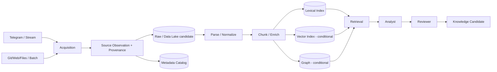

# OTUS Lesson 12 — FATHER OSINT Agent / Data Architecture for AI Systems

**Project:** `VictorKVS/OSINT_deepseek`  
**Status:** `CONDITIONAL_PASS / DOCUMENTATION LAYER`

## What the lesson asks

Design an end-to-end AI data pipeline, distinguish stream vs batch sources, choose storage classes appropriately, explain Feature Store and prevent training-serving skew.

## OSINT/Knowledge Factory pipeline

The design is raw-first: preserve original evidence and integrity/provenance before semantic transformation. Derivatives remain rebuildable and versioned.

## Data zones

- **Raw/Bronze:** original bytes/text + source observation + hash/provenance.
- **Curated/Silver:** parsed, normalized and chunked content with transformation versions.
- **Semantic/Gold candidate:** embeddings, entities, claims, relations and reviewed candidates. “Gold” does not automatically mean truth.

## Storage selection

| Role | Candidate storage class |
|---|---|
| original/raw evidence | object storage / Data Lake raw zone |
| task/observation/version metadata | relational DB / metadata catalog |
| lexical retrieval | search index |
| semantic retrieval | Vector DB/index only after eval proves value |
| relationship traversal | graph store only if graph use cases justify it |
| eval/training datasets | versioned object/lakehouse dataset registry |
| telemetry/analytics | warehouse/lakehouse when scale justifies it |
| shared offline/online ML features | Feature Store, conditionally |

No concrete product such as Kafka/S3/Pinecone/Neo4j is selected without workload and operational evidence.

## Feature Store and Training–Serving Skew

Current core decision:

`FEATURE_STORE = NOT_REQUIRED_FOR_CURRENT_CORE`

Reason: current verified OSINT core is evidence collection/provenance, not online supervised feature serving.

Feature Store becomes justified when an approved model uses the same engineered features offline for training/evaluation and online for inference/ranking.

Skew examples:

- different time windows offline/online;
- different null/default logic;
- different entity mapping/version;
- future data accidentally leaking into offline training;
- duplicated feature code drifting between pipelines.

Control:

`one canonical feature definition → versioned transform → point-in-time correct offline values → same online definition → monitor drift/skew`.

## RAG consistency

RAG has a related consistency problem even without Feature Store: chunking version, embedding model/version, metadata schema and index generation must be aligned between evaluation and Production serving.

## Data Governance

Every material derivative should preserve lineage:

`source → observation → raw hash/file → parser version → chunk → model/index version → retrieval → claim/relation → review → knowledge gate`.

Production readiness also requires owner, data class, retention/deletion policy, external-processing policy, version state and audit.

## What remains UNKNOWN

- Production data volume/growth;
- retention/deletion periods by class;
- storage/index SLO;
- chosen vector/graph technology;
- data residency constraints;
- first trained model that would actually require Feature Store.

## Result

`LESSON_12_DATA_ARCHITECTURE = CONDITIONAL_PASS`

## What should be improved

| Priority | Improvement |
|---|---|
| P0 | complete Production data classification/retention/deletion/external-processing matrix |
| P1 | introduce dataset/index version registry and rebuild/migration procedure |
| P1 | validate lineage raw→chunk→embedding/claim→review→knowledge |
| P1 | add per-stage data-quality telemetry |
| P1 | benchmark retrieval/storage layers before selecting technologies |

Canonical pack: `OSINT_deepseek/docs/course_live_reproduction/12_data_architecture/`.
