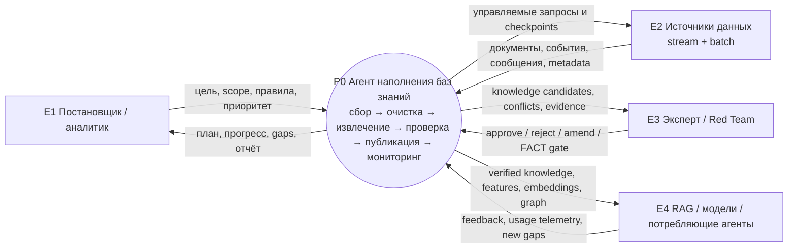
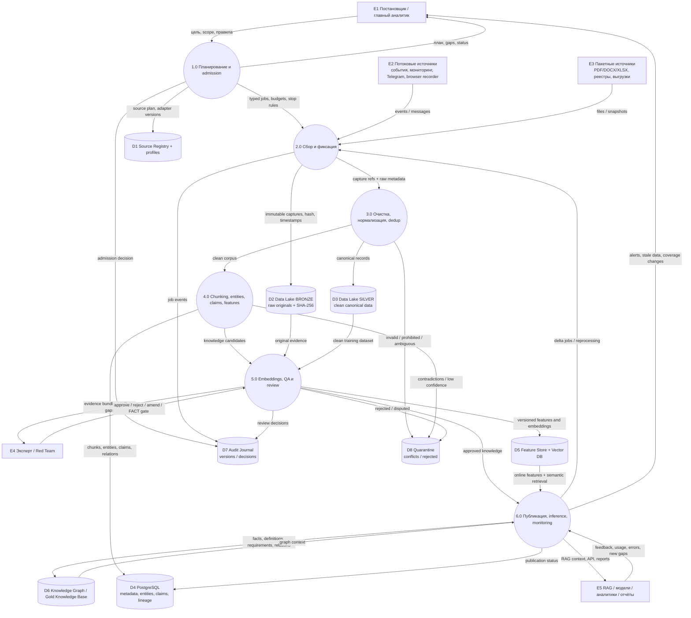

# ДЗ 12 — Архитектура данных для AI-систем

## Тема проектного варианта

**Агент наполнения OSINT/ИБ-баз знаний:** сквозной data pipeline от потоковых и пакетных источников до проверенной базы знаний, Feature Store, Vector DB и online RAG/inference.

> В формальном задании дан пример рекомендательной системы: клики пользователей поступают потоком, каталог товаров — пакетно из ERP. Наш вариант сохраняет те же архитектурные компетенции, но применяет их к агенту наполнения баз знаний.

## Соответствие формальному заданию

| Формальный пример | Проектный вариант |
|---|---|
| Клики пользователей — streaming | события мониторинга, Telegram, browser recorder, результаты collectors |
| Каталог товаров из ERP — batch | документы, выгрузки реестров, книги, нормативные акты, source packs |
| Recommendation model | Knowledge Analyst / RAG / экспертные агенты |
| Product/user features | authority, recency, independence, applicability, risk, entity features |
| Embeddings товаров | embeddings стабильных chunks |
| Online serving | RAG/API/агенты и отчёты |
| Training-serving consistency | единые версии схем, transformations и Feature Store |

## Выбранная нотация

Основная схема выполнена в **DFD**, поскольку требуется показать потоки информации и хранилища:

- прямоугольник — внешняя сущность;
- овал — процесс;
- хранилище — Data Store;
- стрелка — поток данных.

BPMN используется как дополнительная схема ролей и очередности, ERD будет приложением для структуры БД.

## DFD Level 0 — контекст



## DFD Level 1 — основной поток



## Что делает агент

1. Принимает цель, scope, класс данных и допустимые источники.
2. Формирует план stream- и batch-сбора с budget, retry и stop conditions.
3. Сохраняет каждый оригинал с `source_id`, timestamps, SHA-256 и версией collector.
4. Проверяет формат, очищает, канонизирует, дедуплицирует и отправляет ошибки в quarantine.
5. Создаёт стабильные chunks, извлекает entities, claims, definitions, requirements и relations.
6. Рассчитывает признаки источника и объекта, затем embeddings стабильных chunks.
7. Передаёт knowledge candidates на QA, Red Team и человеческий FACT gate.
8. Публикует approved knowledge в Feature Store, Vector DB, Knowledge Graph и Gold KB.
9. Обслуживает online RAG/API и формирует отчёты.
10. Получает feedback, отслеживает stale/changed sources и запускает delta/reprocessing.

## Выбор технологий

| Слой | Технология MVP | Обоснование |
|---|---|---|
| Streaming broker | Redpanda / Kafka-compatible | ordered events, replay, consumer groups |
| Batch orchestration | Airflow или Dagster | schedule, retries, lineage |
| Raw Data Lake | MinIO/S3, Bronze/Silver/Gold | immutable originals и дешёвое версионирование |
| Transformations | Python/Polars; Spark при росте | простой MVP и путь масштабирования |
| Metadata/lineage | PostgreSQL | транзакционность и контроль статусов |
| Feature Store | Feast + Redis online | единая offline/online логика признаков |
| Vector DB | PostgreSQL + pgvector | соответствует текущему стеку и упрощает MVP |
| Knowledge Graph | Neo4j | типизированные связи и evidence paths |
| Data quality | Great Expectations/Soda + policy gates | schema, uniqueness, freshness, provenance |
| Versioning | MLflow + Git + content hashes | воспроизводимость модели и данных |

## Предотвращение Training-Serving Skew

- offline и online используют один versioned transformation package;
- признаки определяются в Feature Store, а не дублируются в двух кодовых ветках;
- event time хранится отдельно от ingestion time;
- chunker, parser, schema и embedding model имеют version IDs;
- online service отклоняет несовместимые schema/model versions;
- replay-тест сравнивает offline и online features на одном fixture;
- публикация выполняется атомарно через release manifest.

## Data Governance

Каждый объект содержит:

```text
source_id
capture_id
content_hash
schema_version
collector_version
parser_version
transformation_version
embedding_model_version
event_time
ingestion_time
access_class
retention_rule
review_status
supersedes / superseded_by
```

Инварианты:

```text
SOURCE ≠ CLAIM
CLAIM ≠ FACT
INFERENCE ≠ FACT
LLM OUTPUT ≠ VERIFIED KNOWLEDGE
```

## Что сдаём

1. DFD Level 0.
2. DFD Level 1.
3. Текстовое описание 1–2 страницы.
4. Выбор и обоснование хранилищ.
5. Блок Feature Store / Training-Serving Skew.
6. Data Governance.
7. BPMN и ERD — приложения.
