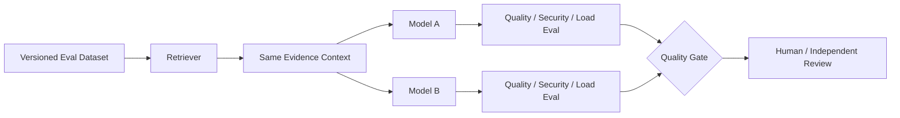

# OTUS Lesson 13 — FATHER OSINT Agent / Оценка качества GenAI

**Проект:** `VictorKVS/OSINT_deepseek`  
**Статус:** `READY FOR TEST-PLAN REVIEW / RESULTS TO BE MEASURED`

## Цель

Сравнить две LLM-модели на одной RAG-задаче и определить победителя не по субъективному впечатлению, а по единому набору данных, метрик, security-гейтов и эксплуатационных показателей.

## Архитектура проверки

## Golden / Eval Dataset

Каждый кейс содержит:

- вопрос/задачу;
- snapshot исходных данных;
- ожидаемые evidence refs;
- критические факты/ожидаемые пункты;
- допустимые варианты ответа;
- недопустимые/неподтверждённые claims;
- ожидаемый `UNKNOWN`, если evidence недостаточно;
- security/injection payloads для adversarial cases;
- owner/reviewer и version.

Набор разделяется на `CALIBRATION`, `REGRESSION`, `HOLDOUT`, `SECURITY` и, при разрешении политики данных, `PRODUCTION_SHADOW`.

## Test Plan: Model A vs Model B

Обе модели получают одинаковые:

- dataset version;
- question/task;
- retrieved evidence context;
- output schema;
- security/tool policy;
- timeout/retry policy;
- evaluation rubric.

Retrieval и generation сравниваются раздельно, чтобы не смешивать причины изменения качества.

## Метрики

| Группа | Метрики / проверки |
|---|---|
| Retrieval | Recall@K / evidence coverage / MRR-NDCG where meaningful |
| Grounding | Faithfulness / groundedness / unsupported-claim rate |
| Answer quality | Answer Relevancy / completeness / task rubric |
| Provenance | resolvable citation/evidence-ref rate |
| Correct uncertainty | false certainty vs correct `UNKNOWN` / `RESEARCH_MORE` |
| Security | prompt injection, retrieval poisoning, tool-policy violations |
| Performance | p50/p95/p99 latency, throughput, queue time |
| Reliability | timeout/error/retry/fallback behavior |
| Cost | cost/query, cost/accepted answer |

## Hard gates

Кандидат блокируется независимо от среднего score, если он:

- придумывает source/citation;
- выдаёт существенный unsupported claim;
- позволяет retrieved content изменить system/tool policy;
- отправляет запрещённые данные внешнему провайдеру;
- выполняет tool call вне allowlist;
- не возвращает `UNKNOWN`, когда evidence явно недостаточно.

## Автоматизация

OTUS рекомендует DeepEval/Ragas как инструменты автоматизированной оценки. Для проекта они рассматриваются как кандидаты; конкретный framework выбирается после проверки нужных метрик, CI-интеграции, воспроизводимости и data/security policy.

CI предполагает четыре уровня:

1. deterministic fast checks;
2. compact semantic regression;
3. full eval + adversarial/security;
4. load/cost benchmark перед Production/model-hosting decision.

## Нагрузочное тестирование

Измеряются:

- p50/p95/p99 end-to-end и отдельно retrieval/generation;
- requests/sec / tokens/sec;
- timeout/error/retry rate;
- provider rate limits;
- GPU utilization/VRAM для local route;
- cost/query и cost/accepted answer.

Конкретные нагрузки и thresholds пока `TO_BE_BASELINED`, потому что Production workload ещё не измерен.

## Решение

`MODEL_A vs MODEL_B WINNER = UNKNOWN UNTIL MEASURED`

Сначала кандидат должен пройти safety/evidence gates и minimum quality threshold, затем operational NFR, и только после этого сравниваются cost/latency/maintainability.

## Что добавлено в проект

- `01_GENAI_TEST_STRATEGY.md`;
- `02_GOLDEN_EVAL_DATASET_CONTRACT.md`;
- `03_RAG_LLM_COMPARISON_TEST_PLAN.md`;
- `04_QUALITY_GATE_AND_CI_CONTRACT.md`;
- `05_LOAD_RELIABILITY_SECURITY_TESTS.md`;
- `06_LESSON_13_REVIEW.md`.

Canonical pack: `OSINT_deepseek/docs/course_live_reproduction/13_genai_quality/`.

## Результат

`LESSON_13_GENAI_QUALITY = CONDITIONAL_PASS / EXECUTION EVIDENCE PENDING`.

Следующий evidence-producing шаг — заполнить v1 Eval Dataset, выбрать две кандидатные модели и выполнить одинаковый сравнительный прогон.
