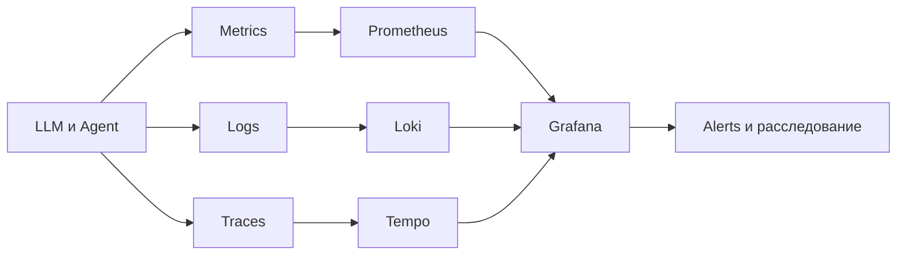

# Урок 15. Observability и безопасность LLM

## Цель

Связать техническую наблюдаемость AI-системы с рисками OWASP GenAI LLM Top 10 и получить воспроизводимый набор дашбордов и алертов.

## Материалы

- `OWASP_LLM_TOP10_2026.md` — актуальный перечень рисков и наблюдаемые сигналы.
- `GRAFANA_DASHBOARDS.md` — принципы выбора и адаптации дашбордов.
- `LLM_OBSERVABILITY_MATRIX.md` — связь риска, метрики, лога, трейса и алерта.
- `grafana/llm-observability-dashboard.json` — стартовый Grafana dashboard.
- `prometheus/llm-alerts.yml` — примеры правил оповещения.
- `SOURCES.md` — первоисточники.

## Поток телеметрии

## Quality Gate

- метрики не содержат prompts, персональные данные и секреты;
- каждый запрос имеет correlation/trace ID;
- измеряются latency, errors, tokens, cost, tool calls и safety events;
- алерты ведут к инструкции реагирования;
- dashboard проверяется на тестовой телеметрии;
- версия OWASP и дата источника зафиксированы.
