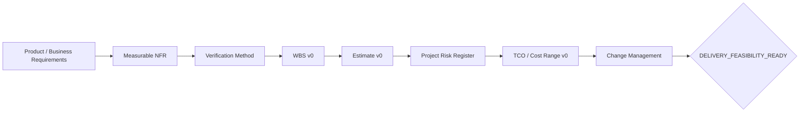

# OTUS Lesson 02 — FATHER OSINT Agent / Requirements → Estimation → Risks → Cost

**Project:** `VictorKVS/OSINT_deepseek`  
**Mode:** one living project across Lessons 01–20  
**Status:** `DOCUMENTATION_LAYER / IN PROGRESS`

## What this lesson adds to the real project

Lesson 02 adds the missing bridge between requirements and architecture/delivery. The project code is not changed. We add evidence-backed documentation for measurable NFRs, estimation, delivery risk, TCO and change control.

## Required chain



## Documents to maintain for OSINT Agent

- NFR Specification;
- NFR Verification Matrix;
- Discovery Question Register;
- Delivery WBS v0;
- Estimate Register v0;
- Estimation Assumption Log;
- Project Risk Register;
- Change Management Model / Change Request;
- TCO Model v0;
- Unit Economics v0 where meaningful;
- Golden Dataset / Evaluation Set plan;
- PoC Gate Criteria.

## Estimation rule

We separate two levels:

### Estimate v0 — before architecture

Used to understand magnitude, uncertainty, risk and cost envelope without pretending that final architecture is already known.

Permitted methods include:

- Analogous;
- Parametric;
- PERT;
- Bottom-Up;
- Hybrid.

For PERT, the calculation convention is:

`E = (O + 4M + P) / 6`

But O/M/P remain estimates and require rationale. The formula does not make the inputs factual.

### Estimate v1 — after architecture selection

Refines effort, TCO, sizing and operational economics using the selected architecture and measured evidence.

## NFR rule

Every material NFR should contain:

```text
metric
baseline / baseline gap
target or TO_BE_BASELINED
priority
verification method
verification owner
source/evidence
```

Training examples from OTUS are examples only. Their numbers are not copied into OSINT Agent as project requirements without evidence.

## Current OSINT-specific gaps

The current DEV baseline has strong behavioral acceptance criteria, but Production-level measurable targets are still incomplete for:

- source/evidence freshness;
- throughput / concurrency;
- latency;
- availability/recovery;
- allowed collection backlog;
- storage growth;
- LLM/RAG quality if those capabilities become in-scope;
- Production operating cost.

## Delivery feasibility gate

```text
DELIVERY_FEASIBILITY_READY
```

The gate requires at minimum:

- material NFRs have a metric or explicit baseline gap;
- each material NFR has a verification intent;
- WBS v0 exists for known scope;
- estimation method and assumptions are visible;
- material project risks have owner/treatment;
- budget/cost envelope exists or is explicitly UNKNOWN with owner;
- change-control mechanism exists;
- acceptance evidence strategy is defined.

## What should be improved

| Priority | Improvement | Target |
|---|---|---|
| P1 | Add measurable Production NFRs and verification matrix | Lessons 2–4 |
| P1 | Build WBS / Estimate v0 for current roadmap | Lessons 2–3 |
| P1 | Cross-link project/security/delivery risks without merging their meanings | Lessons 2–9 |
| P1 | Add formal Change Request workflow | Lessons 2–10 |
| P1 | Create LLM/API/self-hosted/on-prem TCO scenario model | Before Lesson 9 |
| P1 | Define Golden Dataset/evaluation ownership | Lessons 2–13 |

## Source of truth

This OTUS file is a course mirror. Canonical project evidence remains in `VictorKVS/OSINT_deepseek`; the generic FATHER feasibility model is maintained in `VictorKVS/KNOWLEDGE_CORE`.
