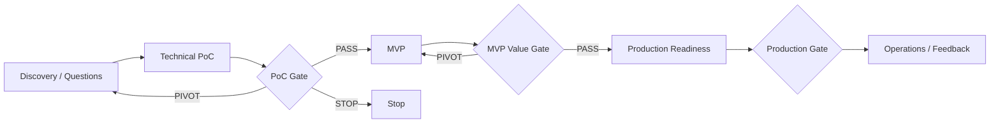

# OTUS Lesson 03 — FATHER OSINT Agent / PoC → MVP → Production

**Project:** `VictorKVS/OSINT_deepseek`  
**Mode:** one living project across Lessons 01–20  
**Status:** `CONDITIONAL_PASS / DOCUMENTATION LAYER`

## What this lesson adds to the real project

Lesson 03 does not add a new implementation. It formalizes how the existing OSINT project should move through evidence-producing delivery stages and prevents us from calling a DEV prototype an MVP or Production system prematurely.

## Current project interpretation

```text
DEV BASELINE      = EXISTING_VERIFIED
TECHNICAL POC     = ACTIVE / M5 TDLib evidence path
MVP PRODUCT       = UNKNOWN / OWNER DECISION REQUIRED
PRODUCTION READY  = NOT CLAIMED
```

## Delivery stages



## Discovery questions that remain material

Before MVP/Production we still need owner-confirmed answers for:

- Which user/customer outcome is the first real MVP?
- Which source classes are permitted for that MVP?
- What is the measurable business/user value?
- What freshness/latency/coverage targets are required?
- What legal/data-processing boundaries apply?
- What Production deployment model is acceptable?
- What TCO/budget envelope is acceptable?
- Who accepts residual Production risk?

## Contract strategy

For high-uncertainty research/AI work, the first technical PoC should not pretend to be a fixed, fully-known implementation. A T&M or capped exploratory phase can be appropriate when uncertainty is high, while a later FP/hybrid phase requires clearer baseline, acceptance and change control.

This is a commercial decision owned jointly by business/project/commercial authority; the architect provides technical uncertainty and impact evidence but does not select the contract alone.

## PoC stage for current OSINT Agent

The current M5 TDLib path fits the technical PoC role:

- prove transport/session behavior;
- collect raw evidence;
- measure restart/rate/error/session characteristics;
- preserve provenance;
- compare alternatives only if the comparison still adds decision value;
- produce evidence for the Transport ADR.

PoC success is not "the script ran once". It requires a bounded hypothesis, setup, raw evidence, conclusion and decision impact.

## MVP stage

MVP is not selected yet. The project has several product opportunities, but one must be explicitly chosen and given measurable value criteria before it becomes `MVP`.

Possible candidate directions already present in the project roadmap include competitive/channel intelligence, content propagation, brand/reputation monitoring and technology/market radar. These are opportunities, not approved MVP scope.

## Production stage

Production requires more than working code. At minimum it needs:

- approved legal/data scope;
- security controls and secrets handling;
- SLO/SLA and support model;
- sizing/capacity assumptions;
- monitoring/observability;
- backup/restore and incident response;
- release/rollback strategy;
- operational roles and access control;
- acceptance evidence and risk authority.

## Lesson 03 risk view

Key project-specific risks include:

- technology-first design before proven need;
- fragile Telegram upstream/transport;
- provenance loss during normalization/deduplication;
- tests proving mocks but not live operational behavior;
- uncontrolled collection/backfill causing cost/rate/storage growth;
- commercial product ideas polluting reusable core;
- legal/privacy scope expansion without explicit authority;
- calling a PoC/MVP/DEV build "Production" without operational evidence.

## What should be improved

| Priority | Improvement | Target |
|---|---|---|
| P1 | Select one bounded MVP outcome | Before claiming MVP |
| P1 | Define measurable product-value evidence for that MVP | Lessons 3–13 |
| P0 | Formalize Production legal/data applicability | Before Production/live regulated scope |
| P1 | Define Production workload/freshness/SLO assumptions | Lessons 15–17 |
| P1 | Standardize PoC report: hypothesis → setup → raw evidence → conclusion → decision impact | Lessons 3–9 |
| P2 | Show explicit lifecycle badges DEV / POC / MVP / PRODUCTION in course/project views | Lessons 3–20 |

## Gate result

```text
LESSON_03_DOCUMENTATION = CONDITIONAL_PASS
```

Reason: PoC→MVP→Production staging is defined and mapped to current evidence, while MVP choice and Production business/operational parameters remain intentionally unresolved.

## Canonical project documents

Detailed project documentation is maintained in:

`OSINT_deepseek/docs/course_live_reproduction/03_poc_to_production/`

including:

- `01_DISCOVERY_QUESTIONS.md`;
- `02_DELIVERY_STRATEGY_AND_CONTRACT.md`;
- `03_POC_MVP_PROD_ROADMAP.md`;
- `04_RISK_MATRIX.md`;
- `05_STAGE_GATE_CRITERIA.md`;
- `06_LESSON_03_REVIEW.md`.

This OTUS file is the lesson-facing mirror; `OSINT_deepseek` remains the engineering source of truth.
