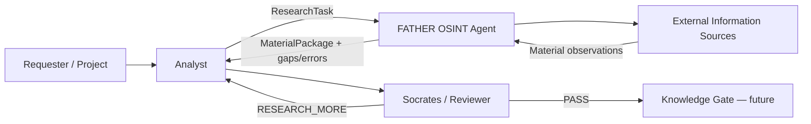
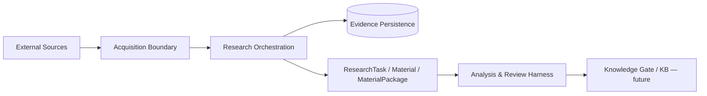

# OTUS Lesson 04 — FATHER OSINT Agent / HLD with C4

**Project:** `VictorKVS/OSINT_deepseek`  
**Status:** `CONDITIONAL_PASS / DOCUMENTATION NORMALIZATION`

Lesson 04 requires C1 Context and C2 Containers. We apply them to the existing OSINT Agent without changing code and without inventing Production infrastructure.

## C1 — System Context

## C2 — Logical Containers

## HLD drivers

- preserve provenance independent of payload reuse;
- bounded research and visible stop conditions;
- partial collector failure isolation;
- source/transport replaceability;
- external content treated as untrusted;
- model output never replaces source evidence;
- collection, analysis, review and knowledge promotion remain separate responsibilities;
- DEV and Production scopes remain explicit.

## Deliberately not selected here

- database engine;
- queue/broker;
- vector DB;
- LLM provider;
- Kubernetes/VM/bare-metal deployment;
- Production topology.

Those require downstream NFRs, PoC/measurements and ADR.

## UNKNOWN

Production deployment, SLO/workload, legal/data boundary, LLM provider set and final Knowledge Gate deployment boundary remain open.

## What should be improved

| Priority | Improvement |
|---|---|
| P1 | create one canonical C4-as-code source and render all views from it |
| P1 | trace NFR/quality scenarios directly into architecture drivers |
| P1 | reuse stable trust-boundary IDs in Threat Model |
| P2 | render C1/C2 in the FATHER project site from the same source |

Detailed project pack: `OSINT_deepseek/docs/course_live_reproduction/04_hld_c4/`.

This OTUS file is a course mirror; `OSINT_deepseek` remains the source of truth.
