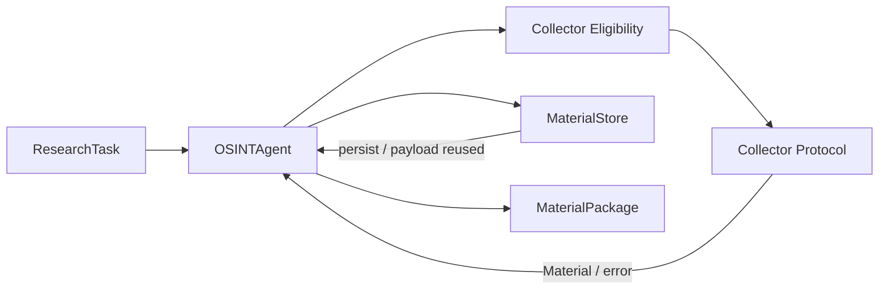

# OTUS Lesson 05 — FATHER OSINT Agent / LLD

**Project:** `VictorKVS/OSINT_deepseek`  
**Status:** `CONDITIONAL_PASS / DOCUMENTATION LAYER`

Lesson 05 requires C3, sequence diagrams and API specification. We apply them to the existing Research Orchestration container without changing code.

## C3

## Key scenarios

- successful bounded collection;
- no eligible collector;
- partial collector failure;
- same payload observed at different source locators without provenance loss;
- bounded follow-up research after reviewer requests more evidence.

## Current contract

The current DEV baseline is Python/domain-contract based:

`ResearchTask -> OSINTAgent / Collector / MaterialStore -> MaterialPackage`.

## OpenAPI

A candidate OpenAPI 3.1 adapter is documented in the canonical project pack. It is explicitly `CANDIDATE / NOT IMPLEMENTED`; the project does not claim an existing HTTP service.

Potential future endpoints:

- submit bounded ResearchTask;
- read task state;
- obtain MaterialPackage.

Any future remote API still needs auth, authorization, idempotency, safe artifact delivery, pagination/streaming and schema versioning.

## What should be improved

| Priority | Improvement |
|---|---|
| P1 | version the domain contract independently of Python classes |
| P1 | prove that an external HTTP API is actually required before implementation |
| P0 | never expose raw local paths or secret-bearing diagnostics through remote API |
| P1 | add idempotency/auth/task ownership if network submission becomes in-scope |

Detailed project pack: `OSINT_deepseek/docs/course_live_reproduction/05_lld/`.

This OTUS file is the course-facing mirror; `OSINT_deepseek` remains source of truth.
