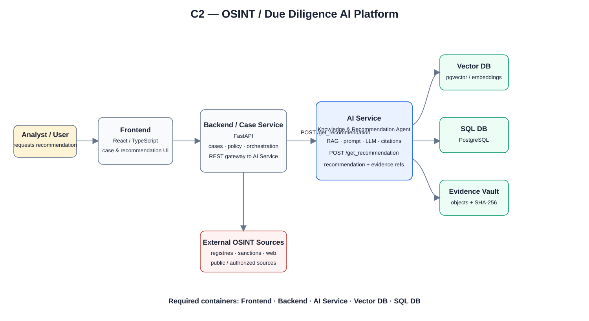
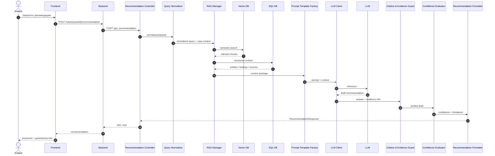

<div align="center">

# 🧭 ДЗ 05 — Многоуровневое проектирование
## C4 Model → C3 AI Service → Sequence → OpenAPI

### OSINT / Due Diligence AI Platform

[](./DZ05_LLD_OSINT_KB_AGENT_SUBMISSION.pdf)
[](./architecture/DIAGRAMS.drawio)
[](./api/openapi.yaml)
[](https://github.com/VictorKVS/OTUS-/actions/workflows/dz5-build-submission-pdf.yml)

**Главная точка входа для проверки домашнего задания**

[📄 PDF](./DZ05_LLD_OSINT_KB_AGENT_SUBMISSION.pdf) · [📝 Условие](./УСЛОВИЕ_ДЗ.md) · [🧩 C2](./architecture/C2_SYSTEM_CONTAINERS.svg) · [🧠 C3](./architecture/C3_KB_AGENT_COMPONENTS.svg) · [🔁 Sequence](./architecture/SEQUENCE_GET_RECOMMENDATION.md) · [⚙️ OpenAPI](./api/openapi.yaml) · [✏️ Draw.io](./architecture/DIAGRAMS.drawio)

</div>

---

## 🎯 Цель работы

Спроектировать многоуровневую архитектуру AI-сервиса так, чтобы **один пользовательский сценарий** последовательно прослеживался через архитектурные уровни и API-контракт:

```text
Пользователь
   ↓
Frontend
   ↓
Backend
   ↓ POST /get_recommendation
AI Service
   ├─ Vector DB
   ├─ SQL DB
   └─ LLM
   ↓
RecommendationResponse + evidence_refs
```

В качестве собственного кейса используется **OSINT / Due Diligence AI Platform**. Аналитик запрашивает рекомендацию по делу: можно ли одобрить контрагента, нужна ли углублённая проверка или какие шаги исследования выполнить дальше.

> **Архитектурный принцип:** AI формирует рекомендацию, объяснение, evidence refs, confidence и limitations, но high-impact управленческое решение остаётся за человеком.

---

# ✅ Соответствие условию ДЗ

| Требование | Реализация | Статус |
|---|---|:---:|
| **C2 Container Diagram** всей системы | [`C2_SYSTEM_CONTAINERS.svg`](./architecture/C2_SYSTEM_CONTAINERS.svg) | ✅ |
| Frontend | React / TypeScript | ✅ |
| Backend | FastAPI / Case Service | ✅ |
| AI Service | Knowledge & Recommendation Agent | ✅ |
| Vector DB | pgvector / vector index | ✅ |
| SQL DB | PostgreSQL | ✅ |
| **C3 Component Diagram** внутри AI Service | [`C3_KB_AGENT_COMPONENTS.svg`](./architecture/C3_KB_AGENT_COMPONENTS.svg) | ✅ |
| **Sequence Diagram** «Пользователь запрашивает рекомендацию» | [`SEQUENCE_GET_RECOMMENDATION.md`](./architecture/SEQUENCE_GET_RECOMMENDATION.md) | ✅ |
| **API Backend ↔ AI Service** | [`api/openapi.yaml`](./api/openapi.yaml) | ✅ |
| Endpoint | `POST /get_recommendation` | ✅ |
| Типы данных | OpenAPI schemas | ✅ |
| Request / response examples | OpenAPI examples | ✅ |
| Коды ошибок | `400 / 401 / 404 / 422 / 429 / 500 / 503` | ✅ |
| Редактируемый файл диаграмм | [`DIAGRAMS.drawio`](./architecture/DIAGRAMS.drawio) | ✅ |
| Единый PDF | [`DZ05_LLD_OSINT_KB_AGENT_SUBMISSION.pdf`](./DZ05_LLD_OSINT_KB_AGENT_SUBMISSION.pdf) | ✅ |

📌 Полная формулировка задания: **[`УСЛОВИЕ_ДЗ.md`](./УСЛОВИЕ_ДЗ.md)**

---

# 1️⃣ C2 — Container Diagram

<div align="center">

[](./architecture/C2_SYSTEM_CONTAINERS.svg)

**Рисунок 1. Контейнеры OSINT / Due Diligence AI Platform**

</div>

| Контейнер | Ответственность | Технология |
|---|---|---|
| **Frontend** | интерфейс аналитика, работа с делом, запрос рекомендации | React / TypeScript |
| **Backend / Case Service** | API gateway, orchestration, policy, structured context | FastAPI |
| **AI Service** | RAG, prompt construction, LLM inference, evidence validation | Python / FastAPI |
| **Vector DB** | semantic retrieval по chunks и knowledge objects | pgvector / vector index |
| **SQL DB** | cases, entities, findings, sources, review state | PostgreSQL |
| **Evidence Vault** | originals, hashes, provenance | object storage |

### Главная интеграция

```text
Backend → POST /get_recommendation → AI Service
```

🔗 [SVG](./architecture/C2_SYSTEM_CONTAINERS.svg) · [Описание](./architecture/C2_SYSTEM_CONTAINERS.md) · [Draw.io](./architecture/DIAGRAMS.drawio)

---

# 2️⃣ C3 — внутреннее устройство AI Service

<div align="center">

[](./architecture/C3_KB_AGENT_COMPONENTS.svg)

**Рисунок 2. Компоненты AI Service**

</div>

### Компоненты

```text
Recommendation Controller
        ↓
Query Normalizer
        ↓
RAG Manager
   ├── Vector DB
   ├── SQL DB
   └── Evidence context
        ↓
Prompt Template Factory
        ↓
LLM Client
        ↓
Citation & Evidence Guard
        ↓
Confidence Evaluator
        ↓
Recommendation Formatter
```

| Компонент | Ответственность |
|---|---|
| **Recommendation Controller** | endpoint `/get_recommendation`, validation, orchestration |
| **Query Normalizer** | query, language, case context |
| **RAG Manager** | semantic + structured retrieval |
| **Prompt Template Factory** | формирование prompt по типу рекомендации |
| **LLM Client** | контролируемый вызов модели |
| **Citation & Evidence Guard** | проверка evidence refs и unsupported claims |
| **Confidence Evaluator** | оценка полноты, конфликтов и ограничений |
| **Recommendation Formatter** | стабильный JSON response contract |
| **Audit Writer** | model/prompt/retrieval versions и execution trail |

🔗 [SVG](./architecture/C3_KB_AGENT_COMPONENTS.svg) · [Описание](./architecture/C3_KB_AGENT_COMPONENTS.md) · [Draw.io](./architecture/DIAGRAMS.drawio)

---

# 3️⃣ Sequence Diagram — «Пользователь запрашивает рекомендацию»



> Если доказательств недостаточно, сервис возвращает **`422 INSUFFICIENT_EVIDENCE`**, а не заполняет пробел выдуманным фактом.

🔗 [Открыть исходный Sequence](./architecture/SEQUENCE_GET_RECOMMENDATION.md)

---

# 4️⃣ OpenAPI 3.1 — Backend ↔ AI Service

### Главный endpoint

```http
POST /get_recommendation
Content-Type: application/json
Authorization: Bearer <JWT>
```

### Пример запроса

```json
{
  "request_id": "REQ-2026-00042",
  "case_id": "CASE-RU-LEGAL-0042",
  "query": "Should the supplier be approved for access to the corporate information system?",
  "recommendation_type": "COUNTERPARTY_RISK",
  "language": "ru",
  "top_k": 8,
  "include_evidence": true
}
```

### Пример ответа

```json
{
  "recommendation_id": "REC-2026-0042",
  "request_id": "REQ-2026-00042",
  "case_id": "CASE-RU-LEGAL-0042",
  "recommendation": "APPROVE_WITH_CONDITIONS",
  "confidence": 0.82,
  "evidence_refs": [
    {
      "source_id": "SRC-FNS-0001",
      "capture_id": "CAP-FNS-20260903-01",
      "chunk_id": "CHK-FNS-17",
      "source_type": "OFFICIAL_REGISTRY"
    }
  ],
  "limitations": [
    "Beneficial ownership chain is not fully verified."
  ],
  "research_gaps": [
    "GAP-UBO-0003"
  ]
}
```

### Ошибки

| HTTP | Код | Значение |
|---:|---|---|
| `400` | `INVALID_REQUEST` | неверный контракт |
| `401` | `UNAUTHORIZED` | authentication |
| `404` | `CASE_NOT_FOUND` | case отсутствует |
| `422` | `INSUFFICIENT_EVIDENCE` | недостаточно доказательств |
| `429` | `RATE_LIMITED` | превышен лимит |
| `500` | `INTERNAL_ERROR` | внутренняя ошибка AI Service |
| `503` | `DEPENDENCY_UNAVAILABLE` | LLM / Vector DB недоступны |

<div align="center">

### ⚙️ **[Открыть полный OpenAPI 3.1 YAML](./api/openapi.yaml)**

</div>

---

# 5️⃣ Дополнительные архитектурные материалы

| Артефакт | Для чего нужен | Ссылка |
|---|---|---|
| **BPMN** | бизнес-процесс исследования и human gate | [SVG](./architecture/BPMN/OSINT_KB_AGENT_BPMN_V1_READABLE.svg) |
| **BPMN 2.0** | редактируемый процесс | [XML](./architecture/BPMN/OSINT_KB_AGENT_BPMN_V1.bpmn) |
| **DFD** | информационные потоки и хранилища | [SVG](./architecture/DFD/OSINT_KB_AGENT_DFD_V1_READABLE.svg) |
| **Information Flow** | детальное описание потоков | [Markdown](./docs/OSINT_KB_AGENT_INFORMATION_FLOW_V1.md) |
| **Draw.io** | редактируемые C2/C3/Sequence | [DIAGRAMS.drawio](./architecture/DIAGRAMS.drawio) |
| **Manifest** | состав комплекта | [MANIFEST.json](./MANIFEST.json) |
| **SHA-256** | контроль итогового PDF | [SHA256SUMS.txt](./SHA256SUMS.txt) |

<details>
<summary><b>Показать BPMN</b></summary>


</details>

<details>
<summary><b>Показать DFD</b></summary>


</details>

---

# 🧪 Автоматическая проверка и сборка

Workflow **`.github/workflows/dz5-build-submission-pdf.yml`** автоматически:

1. валидирует OpenAPI 3.1;
2. собирает итоговый PDF;
3. проверяет PDF;
4. рассчитывает SHA-256;
5. коммитит актуальный PDF и checksum в `main`.

<div align="center">

[](https://github.com/VictorKVS/OTUS-/actions/workflows/dz5-build-submission-pdf.yml)

</div>

---

# 📦 Что именно отправить преподавателю

> ### Основная ссылка
> **Эта папка GitHub + готовый PDF.**

### Быстрый маршрут проверки

1. **README** — эта страница.
2. **C2** — [открыть](./architecture/C2_SYSTEM_CONTAINERS.svg).
3. **C3** — [открыть](./architecture/C3_KB_AGENT_COMPONENTS.svg).
4. **Sequence** — [открыть](./architecture/SEQUENCE_GET_RECOMMENDATION.md).
5. **OpenAPI** — [открыть](./api/openapi.yaml).
6. **PDF** — [открыть](./DZ05_LLD_OSINT_KB_AGENT_SUBMISSION.pdf).
7. **Draw.io** — [скачать/открыть](./architecture/DIAGRAMS.drawio).

<div align="center">

## 📄 **[ОТКРЫТЬ ГОТОВЫЙ PDF ДЛЯ СДАЧИ](./DZ05_LLD_OSINT_KB_AGENT_SUBMISSION.pdf)**

**C2 SYSTEM → C3 AI SERVICE → SEQUENCE → OPENAPI `/get_recommendation`**

---

*VictorKVS · OTUS · ИИ-архитектор · 2026*

</div>
