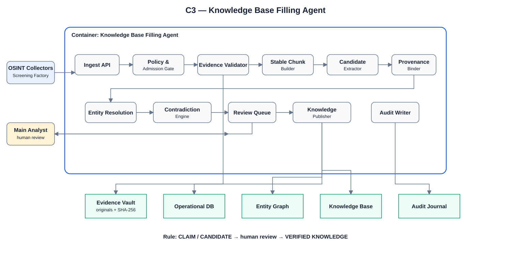
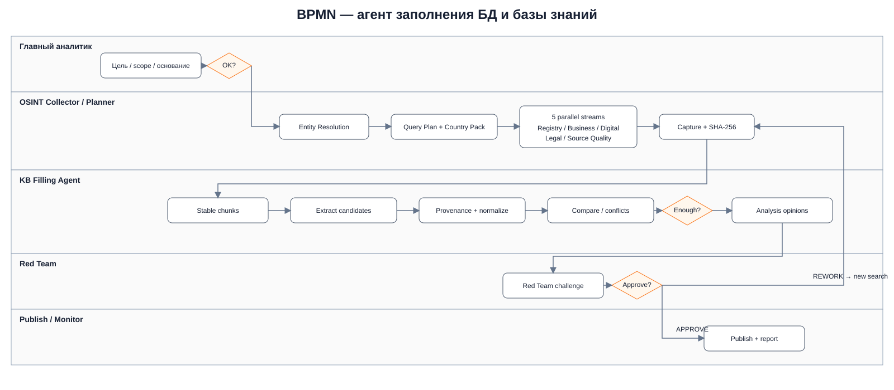
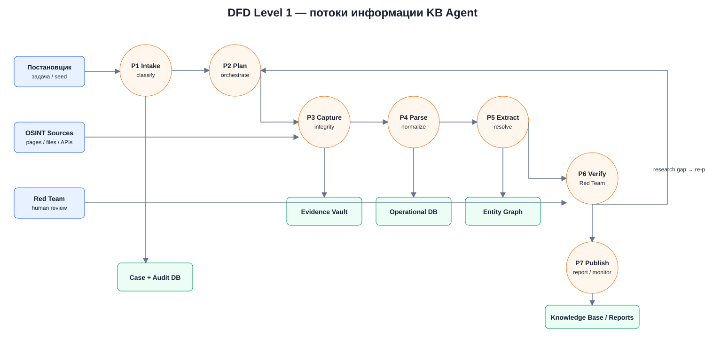

# ДЗ 05 — LLD: OSINT Knowledge Base Filling Agent

## 1. Что спроектировано

Для домашнего задания выбран контейнер **Knowledge Base Filling Agent** из проектируемой OSINT / Due Diligence платформы.

Его задача — принять доказательственный пакет от контура сбора, проверить целостность и допустимость, разбить материал на устойчивые фрагменты, извлечь сущности/утверждения/связи, привязать provenance, выявить противоречия, передать спорные объекты на human review и только после утверждения записать проверенные знания в Knowledge Base.

Ключевой принцип:

```text
SOURCE → CAPTURE → CHUNK → CLAIM/CANDIDATE → REVIEW → VERIFIED KNOWLEDGE
```

Автоматический компонент **не имеет права самостоятельно выполнять переход `CLAIM → FACT`**.

---

## 2. Соответствие условию ДЗ

| Требование | Реализация |
|---|---|
| Выбрать один контейнер | `Knowledge Base Filling Agent` |
| C3 Component diagram | `architecture/C3_KB_AGENT_COMPONENTS.svg` / `.md` / `.dot` |
| Спроектировать API | `api/openapi.yaml` (OpenAPI 3.1) |
| Sequence diagram для ключевого сценария | `architecture/SEQUENCE_EVIDENCE_TO_KB.md` |
| Детализация компонентов и взаимодействий | C3 + описание ниже |
| Дополнительная визуализация потоков | BPMN и DFD в `architecture/BPMN` и `architecture/DFD` |

Условие занятия вынесено в [`УСЛОВИЕ_ДЗ.md`](./УСЛОВИЕ_ДЗ.md).

---

## 3. C3 — компоненты контейнера



Основные компоненты:

1. **Ingest API** — принимает `EvidencePackage` и команды обработки.
2. **Policy & Admission Gate** — проверяет purpose, access class, legal basis и допустимость обработки.
3. **Evidence Validator** — проверяет manifest, SHA-256, lineage и наличие оригинала.
4. **Stable Chunk Builder** — формирует устойчивые `chunk_id` и локаторы на исходный материал.
5. **Candidate Extractor** — извлекает `ENTITY / CLAIM / EVENT / RELATION / DEFINITION / REQUIREMENT` candidates.
6. **Provenance Binder** — привязывает каждый кандидат к `source_id → capture_id → chunk_id`.
7. **Entity Resolution** — exact match, aliases, candidates; без silent fuzzy merge.
8. **Contradiction Engine** — сравнивает новое знание с существующими версиями и фиксирует `CONFLICT / SUPERSEDES / STALE`.
9. **Review Queue** — передаёт существенные объекты главному аналитику.
10. **Knowledge Publisher** — публикует только утверждённые объекты в KB/Graph/Operational DB.
11. **Audit Writer** — append-only запись всех существенных переходов.

---

## 4. Основной сценарий

```text
OSINT Collector / Screening Factory
          ↓ EvidencePackage
       Ingest API
          ↓
 Policy & Admission Gate
          ↓
   Evidence Validator
          ↓
     Evidence Vault
          ↓
 Stable Chunk Builder
          ↓
 Candidate Extractor
          ↓
 Provenance Binder
          ↓
 Entity Resolution
          ↓
 Contradiction Engine
          ↓
      Review Queue
          ↓
     Main Analyst
      ↙       ↘
 REWORK      APPROVE
   ↓            ↓
новый поиск  Knowledge Publisher
                ↓
     KB + Graph + Operational DB
                ↓
          Audit Journal
```

Sequence diagram: [`architecture/SEQUENCE_EVIDENCE_TO_KB.md`](./architecture/SEQUENCE_EVIDENCE_TO_KB.md).

---

## 5. API

Спецификация: [`api/openapi.yaml`](./api/openapi.yaml).

Основные операции:

| Endpoint | Назначение |
|---|---|
| `POST /v1/evidence-packages` | зарегистрировать доказательственный пакет |
| `GET /v1/evidence-packages/{packageId}` | получить состояние пакета |
| `POST /v1/evidence-packages/{packageId}/process` | запустить детерминированный pipeline |
| `GET /v1/review-items` | очередь объектов на human review |
| `POST /v1/review-items/{reviewItemId}/decision` | `APPROVE / REWORK / REJECT` |
| `GET /v1/cases/{caseId}/coverage` | покрытие доказательствами и пробелы |
| `GET /v1/cases/{caseId}/lineage/{objectId}` | трассировка объекта до оригинального evidence |

API не предоставляет endpoint, позволяющий модели напрямую создать `FACT`.

---

## 6. Модель данных

```text
CASE
 ├─ SOURCE
 │   └─ SOURCE_CAPTURE
 │       └─ STABLE_CHUNK
 │           ├─ CLAIM_CANDIDATE
 │           ├─ ENTITY_CANDIDATE
 │           ├─ RELATION_CANDIDATE
 │           └─ EVENT_CANDIDATE
 │
 ├─ REVIEW_ITEM
 │   └─ REVIEW_DECISION
 │
 └─ VERIFIED_KNOWLEDGE
     ├─ FACT
     ├─ DEFINITION
     ├─ REQUIREMENT
     ├─ RELATION
     └─ VERSION/SUPERSESSION
```

Для каждого производного объекта хранятся `source_id`, `capture_id`, `chunk_id`, parser/model/tool version и ограничения вывода.

---

## 7. Хранилища

| Хранилище | Назначение |
|---|---|
| Evidence Vault | неизменяемые оригиналы и SHA-256 |
| Operational DB | cases, jobs, sources, captures, claims, statuses |
| Entity Graph | сущности, связи и timeline — производное представление |
| Knowledge Base | только проверенные знания |
| Audit Journal | append-only история изменений |

**Evidence Vault является доказательственным основанием. Graph и KB не заменяют первичный источник.**

---

## 8. Дополнительные схемы

### BPMN



Редактируемый BPMN 2.0 XML: [`OSINT_KB_AGENT_BPMN_V1.bpmn`](./architecture/BPMN/OSINT_KB_AGENT_BPMN_V1.bpmn).

### DFD Level 1



Подробное описание потоков: [`docs/OSINT_KB_AGENT_INFORMATION_FLOW_V1.md`](./docs/OSINT_KB_AGENT_INFORMATION_FLOW_V1.md).

---

## 9. Архитектурные ограничения

- `SOURCE ≠ CLAIM ≠ FACT`.
- LLM / extractor / graph algorithm не публикует `FACT` напрямую.
- Fuzzy entity match не приводит к silent merge.
- Любое существенное знание имеет evidence lineage.
- `NO_HIT` не означает доказанное отсутствие факта.
- Новая версия не стирает старую — используется supersession/versioning.
- Restricted evidence не экспортируется в публичный контур.

---

## 10. Структура папки

```text
ДЗ_05_OSINT_KB_Agent_LLD/
├── README.md
├── УСЛОВИЕ_ДЗ.md
├── api/
│   └── openapi.yaml
├── architecture/
│   ├── C3_KB_AGENT_COMPONENTS.md
│   ├── C3_KB_AGENT_COMPONENTS.svg
│   ├── SEQUENCE_EVIDENCE_TO_KB.md
│   ├── BPMN/
│   │   ├── OSINT_KB_AGENT_BPMN_V1.bpmn
│   │   ├── OSINT_KB_AGENT_BPMN_V1_READABLE.svg
│   └── DFD/
│       ├── OSINT_KB_AGENT_DFD_V1_READABLE.svg
├── docs/
│   └── OSINT_KB_AGENT_INFORMATION_FLOW_V1.md
└── MANIFEST.json
```

---

## 11. Итог

LLD показывает один контейнер на уровне внутренних компонентов, их ответственности, API и последовательности взаимодействия. BPMN/DFD добавлены как поддерживающие артефакты и демонстрируют место контейнера в общем производственном процессе OSINT-платформы.
