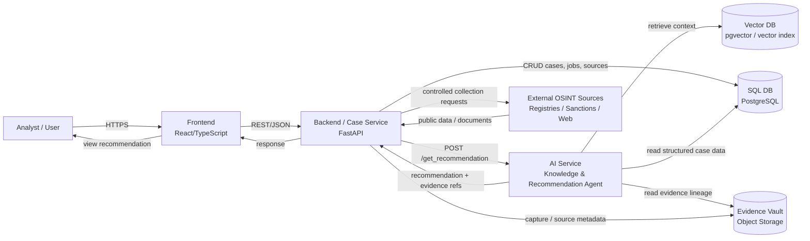

# C2 Container Diagram — OSINT / Due Diligence AI Platform

## Containers

| Container | Responsibility | Technology |
|---|---|---|
| Frontend | analyst workspace, case view, recommendation UI | React / TypeScript |
| Backend / Case Service | case orchestration, policy, source registry, API gateway | FastAPI |
| AI Service | retrieval, prompt assembly, LLM reasoning, recommendation generation, evidence citations | Python / FastAPI |
| Vector DB | semantic retrieval over approved knowledge and case chunks | PostgreSQL + pgvector / vector index |
| SQL DB | cases, entities, sources, jobs, findings, review state | PostgreSQL |
| Evidence Vault | immutable source captures, documents and SHA-256 | object storage |
| External OSINT Sources | public registries, sanctions, web sources | external systems |

The AI Service cannot promote a claim to a verified FACT automatically. It produces a recommendation with evidence references and confidence/limitations for analyst review.
