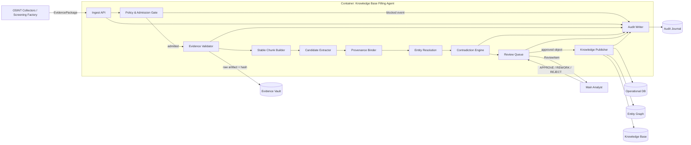

# C3 Component Diagram — Knowledge Base Filling Agent

## Правило публикации

`Knowledge Publisher` принимает только объект, для которого существует явное human review decision. Компоненты извлечения и анализа не имеют прямой записи в `Knowledge Base`.
