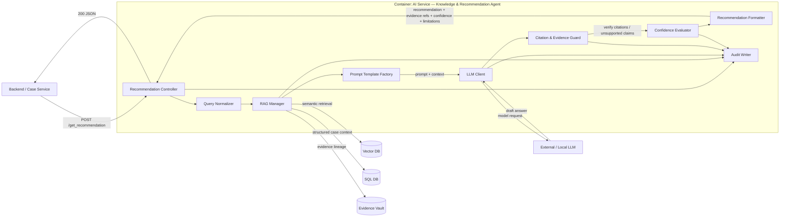

# C3 Component Diagram — AI Service

Контейнер **AI Service** на C2 реализован как `Knowledge & Recommendation Agent`. Его задача — принять запрос от Backend, собрать релевантный контекст из Vector DB и SQL DB, сформировать prompt, вызвать LLM, проверить доказательность ответа и вернуть рекомендацию с цитатами, уровнем уверенности и ограничениями.

## Компоненты и ответственность

| Компонент | Ответственность |
|---|---|
| Recommendation Controller | REST endpoint `/get_recommendation`, валидация запроса, orchestration |
| Query Normalizer | нормализация вопроса, языка, объекта и контекста кейса |
| RAG Manager | retrieval из Vector DB, SQL DB и Evidence Vault |
| Prompt Template Factory | сборка системного prompt и контекста по типу задачи |
| LLM Client | вызов выбранной LLM с timeout/retry и версионированием модели |
| Citation & Evidence Guard | проверка, что существенные утверждения имеют evidence refs |
| Confidence Evaluator | оценка полноты контекста, противоречий и ограничений |
| Recommendation Formatter | формирует стабильный JSON-контракт ответа |
| Audit Writer | пишет модель, prompt version, retrieval ids и результат в audit trail |

## Архитектурное правило

AI Service возвращает **рекомендацию**, а не автоматически утверждённый `FACT`. Для high-impact решений сохраняется human review gate.
