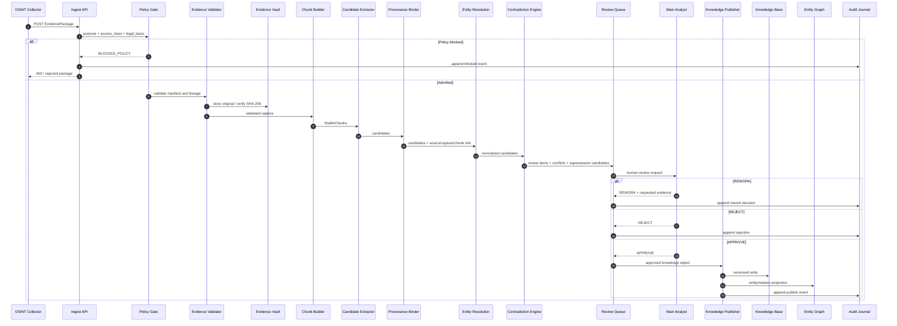

# Sequence Diagram — Evidence Package → Knowledge Base

```mermaid
sequenceDiagram
    autonumber
    participant C as OSINT Collector
    participant API as Ingest API
    participant P as Policy Gate
    participant V as Evidence Validator
    participant EV as Evidence Vault
    participant CH as Chunk Builder
    participant EX as Candidate Extractor
    participant PB as Provenance Binder
    participant ER as Entity Resolution
    participant CE as Contradiction Engine
    participant RQ as Review Queue
    participant A as Main Analyst
    participant KP as Knowledge Publisher
    participant KB as Knowledge Base
    participant G as Entity Graph
    participant AU as Audit Journal

    C->>API: POST EvidencePackage
    API->>P: purpose + access_class + legal_basis
    alt Policy blocked
        P-->>API: BLOCKED_POLICY
        API->>AU: append blocked event
        API-->>C: 403 / rejected package
    else Admitted
        P->>V: validate manifest and lineage
        V->>EV: store original / verify SHA-256
        V->>CH: validated capture
        CH->>EX: StableChunks
        EX->>PB: candidates
        PB->>ER: candidates + source/capture/chunk refs
        ER->>CE: normalized candidates
        CE->>RQ: review items + conflicts + supersession candidates
        RQ->>A: human review request
        alt REWORK
            A-->>RQ: REWORK + requested evidence
            RQ->>AU: append rework decision
        else REJECT
            A-->>RQ: REJECT
            RQ->>AU: append rejection
        else APPROVE
            A-->>RQ: APPROVE
            RQ->>KP: approved knowledge object
            KP->>KB: versioned write
            KP->>G: entity/relation projection
            KP->>AU: append publish event
        end
    end
```
