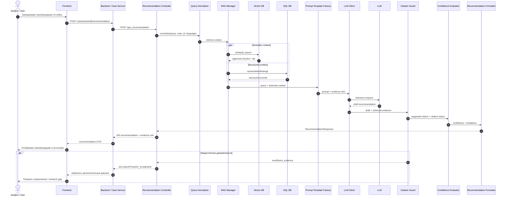

# Sequence Diagram — Пользователь запрашивает рекомендацию

## Связь с C3

Каждый компонент Sequence Diagram присутствует на C3 AI Service: `Recommendation Controller`, `Query Normalizer`, `RAG Manager`, `Prompt Template Factory`, `LLM Client`, `Citation & Evidence Guard`, `Confidence Evaluator`, `Recommendation Formatter`.
