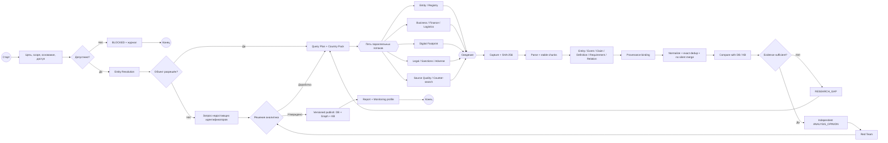
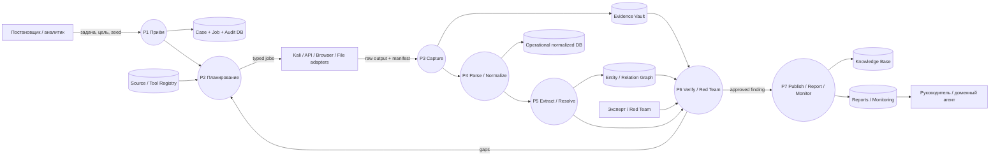

# Агент заполнения баз данных и базы знаний — бизнес-схема v1

## Выбранные нотации

- **BPMN 2.0** — кто и в какой последовательности выполняет работу, где параллельность, шлюзы и возврат на доисследование.
- **DFD Level 1** — какие информационные потоки входят в агент, какие хранилища он заполняет и что передаёт дальше.

## Роль агента

Агент не является сборщиком «всего подряд» и не создаёт FACT самостоятельно. Он получает доказательственный пакет, сохраняет происхождение, преобразует материал в устойчивые объекты, сравнивает их с уже накопленными данными, показывает противоречия и готовит кандидаты для утверждения человеком.

## Что агент записывает

| Хранилище | Содержание | Авторитетность |
|---|---|---|
| Evidence Vault | неизменяемые оригиналы, SHA-256, metadata | первичный доказательственный слой |
| Operational DB | дела, задания, источники, captures, claims, статусы | операционная система учёта |
| Entity Graph | сущности, типизированные связи, даты, evidence refs | производное представление |
| Knowledge Base | утверждённые факты, определения, требования, методы, версии | экспертно проверенный слой |
| Audit Journal | все действия и переходы, hash-chain | аудиторский след |

## BPMN — логика работы

## DFD — информационные потоки

## Обязательные выходы одного цикла

1. `SOURCE_CAPTURE` с SHA-256 и исходным locator.
2. Stable chunks с точными границами и ссылкой на оригинал.
3. Кандидаты сущностей, событий, утверждений, определений, требований и связей.
4. Запрет silent merge для тёзок и одноимённых организаций.
5. Реестр противоречий, версий и supersession.
6. `RESEARCH_GAP`, если данных недостаточно.
7. Независимые `ANALYSIS_OPINION`, но не автоматический FACT.
8. Human-approved finding.
9. Версионная запись в Operational DB, Graph и Knowledge Base.
10. Справка, export manifest, monitoring profile и audit event.

## Acceptance gate для ДЗ

ДЗ считается завершённым на уровне архитектуры, когда:

- BPMN показывает роли, параллельные потоки, шлюзы и цикл доисследования;
- DFD показывает все хранилища и направления движения данных;
- определены входные и выходные контракты агента;
- зафиксировано разделение SOURCE / CAPTURE / CLAIM / FACT / INFERENCE / HYPOTHESIS;
- сохранена трассировка до исходного фрагмента;
- предусмотрены contradiction, version и supersession;
- FACT создаётся только после human review;
- предусмотрены отчёт, мониторинг и повторный прогон.
