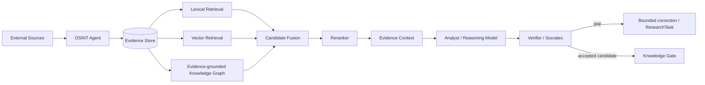

# OTUS Lesson 06 — FATHER OSINT Agent / RAG Architecture

**Project:** `VictorKVS/OSINT_deepseek`  
**Status:** `CANDIDATE / EVALUATION REQUIRED`

RAG is placed downstream of OSINT evidence acquisition; the collector itself does not become a truth/generation engine.

## Candidate architecture

## Evaluation order

1. deterministic/lexical baseline;
2. vector retrieval;
3. hybrid lexical + vector + reranker;
4. graph-assisted retrieval only where it adds measurable value.

Self-RAG/CRAG/cache patterns are options, not default requirements. They must earn adoption through quality/cost/risk evidence.

## RAG invariants

- every hit retains source/version/evidence locator;
- generated answer is not evidence;
- similarity score is not source trust;
- retrieved content is untrusted content;
- conflicts are preserved;
- bounded correction may request new OSINT evidence;
- Knowledge Gate remains separate from generation.

## Required evaluation

- retrieval coverage/Recall@k;
- ranking quality;
- citation resolution;
- groundedness;
- conflict visibility;
- freshness;
- latency/cost;
- reviewer rework rate.

## Security

Must address prompt/retrieval poisoning, corpus changes, sensitive evidence sent to external providers, model/index versioning and rollback.

## What should be improved

| Priority | Improvement |
|---|---|
| P1 | build a versioned retrieval/golden query set |
| P1 | prove lexical baseline before advanced RAG complexity |
| P0 | enforce provenance and untrusted-content boundary |
| P1 | version embedding/reranker/generator/index in evaluation evidence |
| P1 | define freshness/index-update SLO from a real Product use case |

Detailed pack: `OSINT_deepseek/docs/course_live_reproduction/06_rag/`.

No RAG implementation is claimed by this answer.
