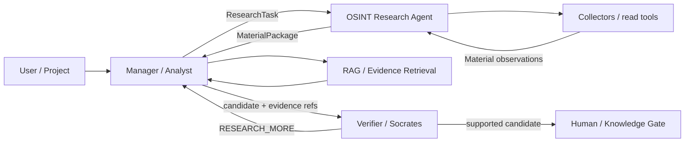

# OTUS Lesson 07 — FATHER OSINT Agent / AI Agents & Multi-Agent

**Project:** `VictorKVS/OSINT_deepseek`  
**Status:** `CANDIDATE / BOUNDED MULTI-AGENT DESIGN`

We reuse the real project roles instead of inventing a travel-agent demo: Analyst/Manager, OSINT Research Agent, source Collectors, RAG/Retrieval, Verifier/Socrates and future Human/Knowledge Gate.

## Architecture

## Single Responsibility

- OSINT acquires evidence, not truth verdicts;
- Analyst interprets evidence and plans bounded follow-up;
- Collector owns one source/protocol boundary;
- Retriever provides evidence context, not authority;
- Verifier challenges claims independently;
- human/gate owns material promotion/acceptance.

## Agent handoff contract

A future agent-to-agent handoff carries task/trace id, objective, scope, exclusions, allowed tools/source classes, budget limits, evidence refs, required output schema, stop conditions, privilege ceiling and review requirement.

## RAG Flow

RAG may provide approved internal policy, prior evidence and knowledge context. Retrieved source text remains untrusted and cannot rewrite policy or authorize tools.

## Security rules

- delegation cannot raise privilege;
- read/write tools separated;
- hard call/time/item/cost bounds;
- deterministic policy gate before tools;
- executor-issued result IDs prove actions;
- no secrets in prompts where avoidable;
- no autonomous KB promotion;
- prompt-injection/retrieval-poisoning tests required before Production agents.

## What should be improved

| Priority | Improvement |
|---|---|
| P0 | formal tool/permission policy before executable agents |
| P0 | prompt-injection and retrieval-poisoning regression corpus |
| P1 | versioned agent handoff schema + trace ids |
| P1 | execution evidence separated from model narrative |
| P1 | prove that multi-agent adds value versus simpler workflow |

Detailed pack: `OSINT_deepseek/docs/course_live_reproduction/07_agents/`.

Current project does not claim a production autonomous multi-agent system.
