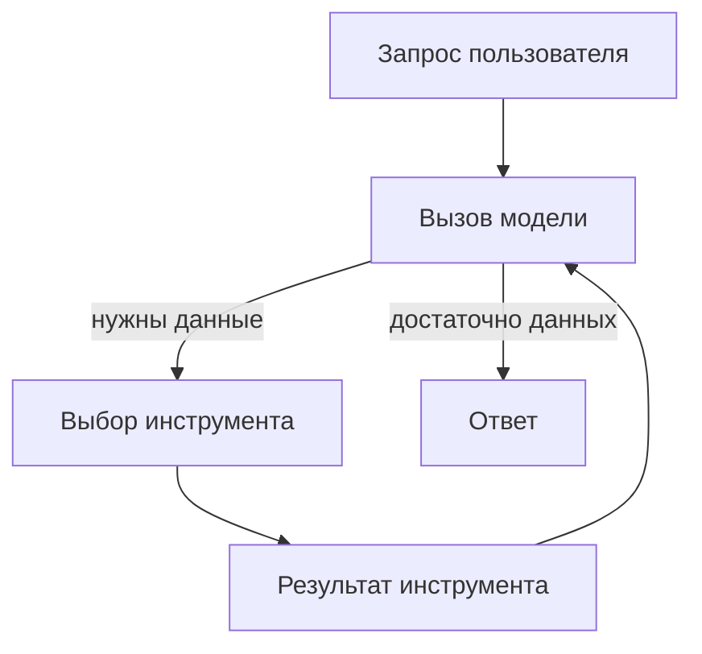

# LangChain Agents: конспект

## Основная идея

LangChain `create_agent` собирает цикл, в котором модель анализирует запрос, выбирает инструмент, получает его результат и продолжает работу до ответа или условия остановки.

Минимальные элементы:

1. `model` — языковая модель или строковый идентификатор провайдера.
2. `tools` — функции с ясными именами, аргументами и описаниями.
3. `system_prompt` — роль, правила, границы и формат результата.
4. `messages` — вход и история диалога.
5. `checkpointer` — память потока; для production требуется постоянное хранилище.

## Архитектурные правила

- инструмент должен выполнять одну понятную операцию;
- описание инструмента является частью контекста модели;
- доступ к данным и действиям ограничивается минимальными правами;
- число итераций и вызовов инструментов ограничивается;
- ошибки, входы, выходы, стоимость и задержка трассируются;
- критические действия требуют подтверждения человека;
- секреты не включаются в prompt, код или журнал;
- агент не подменяет детерминированные вычисления рассуждением LLM.

## Отличие прототипа от production

| Область | Прототип | Production |
|---|---|---|
| Память | In-memory | Постоянное хранилище |
| Наблюдаемость | Вывод в консоль | Трассировка, метрики, аудит |
| Инструменты | Учебные функции | Авторизация, timeout, retry |
| Безопасность | Базовый prompt | Policy enforcement и HITL |
| Качество | Несколько примеров | Версионируемый eval-набор |

## Проверки

- позитивный запрос вызывает нужный инструмент;
- запрос без данных заканчивается отказом от догадки;
- некорректные аргументы не приводят к действию;
- превышение лимита останавливает цикл;
- результат содержит ссылку или ID источника.
