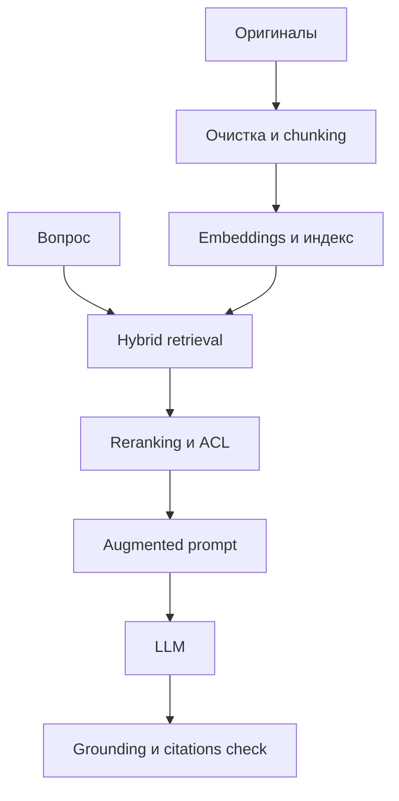

# RAG Pipeline: конспект и проектирование

RAG дополняет запрос релевантными фрагментами из внешних авторитетных данных. Базовая цепочка состоит из ingestion, retrieval, augmentation и generation.

## 1. Ingestion

1. Зарегистрировать оригинал и лицензию.
2. Извлечь и очистить текст без потери структуры.
3. Разбить документ на смысловые чанки.
4. Добавить метаданные: `source_id`, раздел, версия, дата и права доступа.
5. Построить embeddings и загрузить их в индекс.

## 2. Retrieval

- преобразовать запрос в embedding;
- выполнить semantic, lexical или hybrid search;
- удалить дубликаты;
- применить фильтры метаданных и ACL;
- переранжировать кандидатов;
- вернуть top-k фрагментов с идентификаторами источников.

## 3. Augmentation

Сформировать контекст, содержащий вопрос, найденные фрагменты и правило: отвечать только по контексту, приводить источники, а при отсутствии ответа прямо сообщать об этом.

## 4. Generation

Модель формирует ответ по переданным доказательствам. После генерации проверяются ссылки, groundedness, полнота и соблюдение политики.

## Метрики

| Метрика | Расчёт | Назначение |
|---|---|---|
| Recall@k | найденные релевантные / все релевантные | Не пропускает ли поиск доказательства |
| Precision@k | релевантные в top-k / k | Не засорён ли контекст |
| Groundedness | подтверждённые утверждения / все проверяемые утверждения | Опирается ли ответ на источники |
| Citation accuracy | корректные ссылки / все ссылки | Правильно ли указаны доказательства |
| p95 latency | 95-й процентиль времени запроса | Стабильность задержки |
| Cost/query | embeddings + retrieval + rerank + LLM | Экономика одного ответа |

## Основные риски

- неверный chunking разрывает смысл;
- устаревшие документы остаются в индексе;
- retrieval возвращает похожий, но неприменимый фрагмент;
- prompt injection приходит из документа;
- права доступа теряются между источником и индексом;
- ответ содержит утверждения без доказательств;
- увеличение top-k повышает стоимость и шум.

## Минимальный production gate

- сохранена трассировка `question → chunks → answer → citations`;
- индекс обновляется при изменении оригинала;
- ACL применяется до передачи контекста модели;
- есть эталонный набор вопросов с ожидаемыми источниками;
- установлены пороги метрик и процедура отката.
