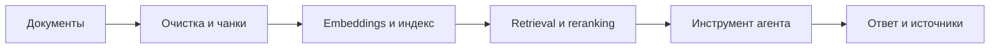

# Урок 7. AI-агент и RAG

## Цель

Создать минимальный помощник архитектора, который вызывает инструменты и отвечает на основе проверяемой базы знаний, а не только памяти языковой модели.

## Цепочка проектирования

## Материалы папки

- `langchain_quickstart.py` — самостоятельный учебный пример агента.
- `LANGCHAIN_NOTES.md` — устройство агента и требования к надёжности.
- `RAG_PIPELINE.md` — проектирование RAG-конвейера.
- `PRACTICE.md` — практическая работа и критерии готовности.
- `SOURCES.md` — первоисточники и дата обращения.
- `requirements.txt` — минимальные зависимости примера.

## Результат урока

Репозиторий должен содержать код агента, схему RAG, тестовый набор вопросов и отчёт с метриками качества, стоимости и задержки.

## Quality Gate

- агент вызывает только разрешённые инструменты;
- каждый фактический ответ сопровождается идентификаторами источников;
- при отсутствии подтверждения агент сообщает, что данных недостаточно;
- измерены Recall@k, Precision@k, groundedness, p95 latency и cost/query;
- секреты передаются через переменные окружения и не попадают в Git.
