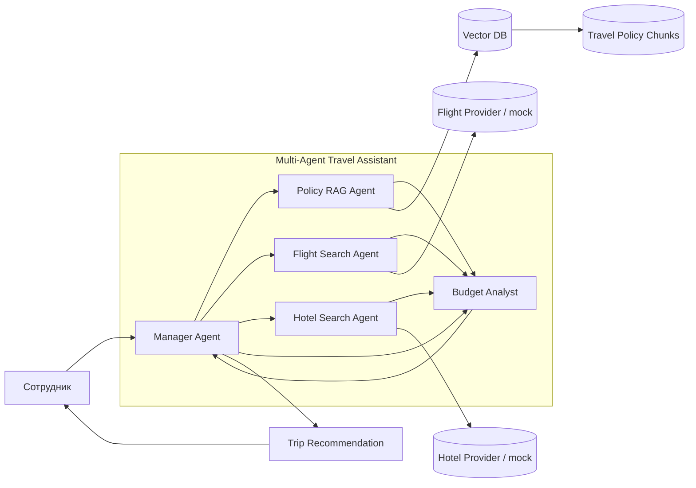
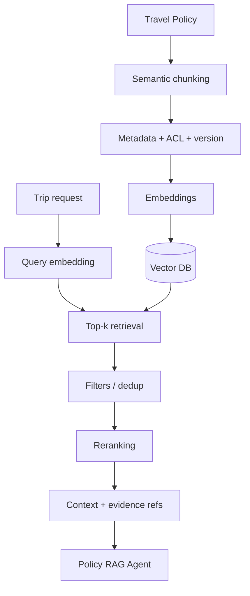

<div align="center">

# ✈️ ДЗ 07 — Multi-Agent Travel Assistant
## AI Agents + RAG + LangGraph

### «Умный помощник» для оформления командировок

[](./architecture/MULTI_AGENT_ARCHITECTURE.md)
[](./architecture/RAG_FLOW.md)
[](./notebooks/travel_multiagent_colab.ipynb)
[](./src/travel_multiagent_demo.py)

[📝 Условие](./УСЛОВИЕ_ДЗ.md) · [🧩 Архитектура](./architecture/MULTI_AGENT_ARCHITECTURE.md) · [🧠 RAG Flow](./architecture/RAG_FLOW.md) · [💻 Код](./src/travel_multiagent_demo.py) · [📓 Notebook](./notebooks/travel_multiagent_colab.ipynb)

</div>

---

## 🎯 Цель

Спроектировать мультиагентную систему с RAG-пайплайном для автоматизации оформления командировок и показать работающий минимальный пример, где **Manager Agent делегирует задачи специализированным агентам и получает их ответы**.

```text
Сотрудник
   ↓
Manager Agent
   ├─ Policy RAG Agent ─→ Vector DB / Travel Policy
   ├─ Flight Search Agent
   ├─ Hotel Search Agent
   └─ Budget Analyst
            ↓
      Manager Agent
            ↓
Trip Recommendation + evidence_refs
```

---

# ✅ Соответствие условию

| Требование | Реализация | Статус |
|---|---|:---:|
| Определить агентов | Manager, Policy RAG, Flight Search, Hotel Search, Budget Analyst | ✅ |
| Single Responsibility | ответственность и запреты описаны отдельно | ✅ |
| Нарисовать взаимодействие агентов | [`MULTI_AGENT_ARCHITECTURE.md`](./architecture/MULTI_AGENT_ARCHITECTURE.md) | ✅ |
| Показать источник политики командировок | `data/travel_policy.md` → chunks → Vector DB → Policy RAG Agent | ✅ |
| Описать chunking | смысловые разделы + stable chunk IDs | ✅ |
| Описать embeddings | production embedding model; offline hash-embedding для демо | ✅ |
| Описать reranking | semantic score + business-term priority | ✅ |
| Manager делегирует Searcher | LangGraph graph + trace/messages | ✅ |
| Colab notebook / псевдокод | [`travel_multiagent_colab.ipynb`](./notebooks/travel_multiagent_colab.ipynb) | ✅ |
| Агенты обмениваются сообщениями | проверяется `tests/test_demo.py` | ✅ |
| Vector DB учтена | отражена на architecture и RAG flow | ✅ |

---

# 🧩 Архитектура мультиагентной системы



Подробное описание: **[`architecture/MULTI_AGENT_ARCHITECTURE.md`](./architecture/MULTI_AGENT_ARCHITECTURE.md)**.

## Single Responsibility

| Агент | Делает | Не делает |
|---|---|---|
| **Manager Agent** | декомпозиция, делегирование, synthesis | не подменяет поисковые/политические агенты |
| **Policy RAG Agent** | ищет корпоративные правила и evidence refs | не бронирует |
| **Flight Search Agent** | подбирает перелёты | не интерпретирует политику |
| **Hotel Search Agent** | подбирает проживание | не утверждает превышение лимита |
| **Budget Analyst** | считает стоимость и проверяет ограничения | не меняет результаты поиска |

---

# 🧠 RAG Flow



Полная спецификация: **[`architecture/RAG_FLOW.md`](./architecture/RAG_FLOW.md)**.

### Что важно в RAG

- chunking выполняется по смысловым разделам политики;
- каждый chunk имеет `source_id/chunk_id/version/ACL`;
- используется Vector DB;
- после retrieval выполняются фильтрация, dedup и reranking;
- ответ возвращает evidence refs;
- если подходящего правила нет — `POLICY_GAP`, а не выдуманное правило.

---

# 💻 Работающий LangGraph-прототип

Файл: **[`src/travel_multiagent_demo.py`](./src/travel_multiagent_demo.py)**.

Демо намеренно работает **без LLM API key и без сети**. Это делает проверку воспроизводимой: LangGraph управляет агентным графом, поисковые источники в примере read-only/mock, а RAG использует локальный deterministic embedding.

```text
Manager
  ↓ delegation
PolicyRAG
  ↓ message
FlightSearch
  ↓ message
HotelSearch
  ↓ message
BudgetAnalyst
  ↓ result
Manager
  ↓
Final recommendation
```

Пример ожидаемого trace:

```text
Manager: decomposed request and delegated policy, flight, hotel and budget tasks
PolicyRAG: retrieved and reranked policy chunks
FlightSearch: returned mock read-only flight options
HotelSearch: returned mock read-only hotel options
BudgetAnalyst: calculated total and checked policy limits
Manager: synthesized final recommendation from delegated results
```

---

# 📓 Colab notebook

[`notebooks/travel_multiagent_colab.ipynb`](./notebooks/travel_multiagent_colab.ipynb)

Минимальная демонстрация выполняет именно требование задания:

```text
Manager → Searcher: найди правила для поездки
Searcher → Manager: правила найдены
Manager: сформирован итоговый ответ
```

Notebook устанавливает `langgraph` одной ячейкой и не требует секретов.

---

# 🧪 Проверка работоспособности

```bash
python -m pip install -r requirements.txt
python -m pytest -q
python src/travel_multiagent_demo.py
```

Тесты проверяют:

1. наличие сообщений от всех агентов;
2. возврат результата обратно Manager;
3. наличие `evidence_refs`;
4. расчёт бюджета;
5. наличие delegation trace.

---

# 📚 Учебная политика командировок

Для демонстрации используется синтетический документ [`data/travel_policy.md`](./data/travel_policy.md), чтобы не зависеть от реальных корпоративных данных.

Пример evidence:

```json
{
  "source_id": "TRAVEL-POLICY-001",
  "chunk_id": "POLICY-HOTEL-001",
  "score": 0.91
}
```

---

# 🗂️ Структура сдачи

```text
ДЗ_07_Travel_MultiAgent_RAG/
├── README.md
├── УСЛОВИЕ_ДЗ.md
├── architecture/
│   ├── MULTI_AGENT_ARCHITECTURE.md
│   └── RAG_FLOW.md
├── data/
│   └── travel_policy.md
├── notebooks/
│   └── travel_multiagent_colab.ipynb
├── src/
│   └── travel_multiagent_demo.py
├── tests/
│   └── test_demo.py
└── requirements.txt
```

---

# 🏁 Что отправить преподавателю

**Основная ссылка:** эта папка в GitHub.

В ней преподаватель сразу получает:

- архитектуру мультиагентной системы;
- RAG Flow с Vector DB;
- Colab-compatible notebook;
- полный LangGraph-прототип;
- тесты обмена сообщениями;
- синтетическую политику командировок;
- точную трассировку evidence.

> Итоговое финансовое согласование и реальное бронирование намеренно не автоматизированы в учебном прототипе. Демо показывает архитектуру, делегирование и обмен сообщениями, не выполняя реальные покупки.
