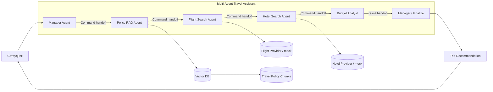
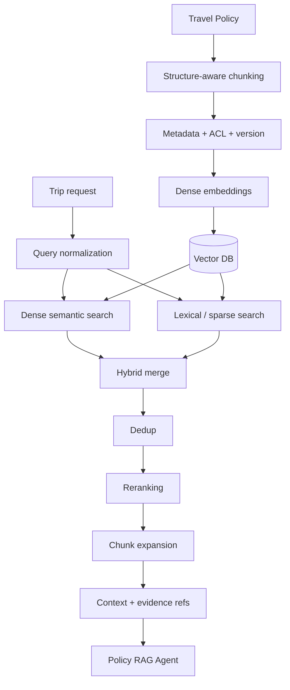

<div align="center">

# ✈️ ДЗ 07 — Multi-Agent Travel Assistant
## AI Agents + Hybrid RAG + LangGraph

### «Умный помощник» для оформления командировок · M1.1

[](./architecture/DZ07_TRAVEL_MULTIAGENT_ARCHITECTURE.pdf)
[](./architecture/RAG_FLOW.md)
[](./architecture/AGENT_HANDOFFS.md)
[](https://colab.research.google.com/github/VictorKVS/OTUS-/blob/main/7.%20%D0%90%D1%80%D1%85%D0%B8%D1%82%D0%B5%D0%BA%D1%82%D1%83%D1%80%D0%BD%D1%8B%D0%B5%20AI-%D0%B0%D0%B3%D0%B5%D0%BD%D1%82%D1%8B%20%D0%B8%20Multi-Agent%20Systems%20%20%D0%94%D0%97/%D0%94%D0%97_07_Travel_MultiAgent_RAG/notebooks/travel_multiagent_colab.ipynb)
[](./src/travel_multiagent_demo.py)

[📝 Условие](./УСЛОВИЕ_ДЗ.md) · [📄 PDF схем](./architecture/DZ07_TRAVEL_MULTIAGENT_ARCHITECTURE.pdf) · [🧩 Архитектура](./architecture/MULTI_AGENT_ARCHITECTURE.md) · [🧠 Hybrid RAG](./architecture/RAG_FLOW.md) · [🔁 Handoffs](./architecture/AGENT_HANDOFFS.md) · [💻 Код](./src/travel_multiagent_demo.py) · [▶️ Colab](https://colab.research.google.com/github/VictorKVS/OTUS-/blob/main/7.%20%D0%90%D1%80%D1%85%D0%B8%D1%82%D0%B5%D0%BA%D1%82%D1%83%D1%80%D0%BD%D1%8B%D0%B5%20AI-%D0%B0%D0%B3%D0%B5%D0%BD%D1%82%D1%8B%20%D0%B8%20Multi-Agent%20Systems%20%20%D0%94%D0%97/%D0%94%D0%97_07_Travel_MultiAgent_RAG/notebooks/travel_multiagent_colab.ipynb)

</div>

---

## 🎯 Цель

Спроектировать мультиагентную систему с RAG-пайплайном для автоматизации оформления командировок и показать работающий минимальный пример, где **Manager Agent делегирует задачи специализированным агентам, агенты реально обмениваются типизированными сообщениями, а Policy RAG возвращает проверяемые evidence refs**.

```text
Сотрудник
   ↓ HumanMessage
Manager Agent
   │ Command handoff
   ├─ Policy RAG Agent ─→ Hybrid Retrieval ─→ Vector DB / Travel Policy
   ├─ Flight Search Agent
   ├─ Hotel Search Agent
   └─ Budget Analyst
            ↓
      Manager Agent
            ↓
Trip Recommendation + evidence_refs
```

> **Главный принцип:** демо воспроизводимо без LLM API key и без внешней сети; production-архитектура при этом явно показывает Vector DB, dense+sparse retrieval, reranking и evidence grounding.

---

# ✅ Соответствие условию

| Требование | Реализация | Статус |
|---|---|:---:|
| Определить агентов | Manager, Policy RAG, Flight Search, Hotel Search, Budget Analyst | ✅ |
| Single Responsibility | каждому агенту отдельно задано «делает / не делает» | ✅ |
| Схема архитектуры PNG/PDF | [`DZ07_TRAVEL_MULTIAGENT_ARCHITECTURE.pdf`](./architecture/DZ07_TRAVEL_MULTIAGENT_ARCHITECTURE.pdf) | ✅ |
| Источник политики командировок | `data/travel_policy.md` → chunks → Vector DB → Policy RAG | ✅ |
| Chunking | structure-aware chunks + stable IDs + section/position | ✅ |
| Embeddings | production embedding model; offline deterministic embedding для CI | ✅ |
| Vector DB | отражена в architecture и RAG Flow | ✅ |
| Reranking | hybrid score + deterministic rerank | ✅ |
| Hybrid retrieval | dense semantic + lexical + business-term signal | ✅ |
| Dedup | dedup по `chunk_id` | ✅ |
| Chunk expansion | соседние chunks того же раздела | ✅ |
| Manager делегирует Searcher | `Command(goto=...)` в LangGraph | ✅ |
| Агенты обмениваются сообщениями | `MessagesState` + `SystemMessage/HumanMessage/AIMessage` | ✅ |
| Colab notebook | [`travel_multiagent_colab.ipynb`](./notebooks/travel_multiagent_colab.ipynb) | ✅ |
| Прямая Open in Colab ссылка | badge и ссылка в начале README | ✅ |
| Работоспособность | pytest + demo в GitHub Actions | ✅ |
| Retrieval quality gate | `data/rag_eval.json`, HitRate@2 / MRR@2 | ✅ |

---

# 🧩 Архитектура мультиагентной системы



**Формат сдачи:** готовая схема — [`architecture/DZ07_TRAVEL_MULTIAGENT_ARCHITECTURE.pdf`](./architecture/DZ07_TRAVEL_MULTIAGENT_ARCHITECTURE.pdf).

Подробное описание: [`architecture/MULTI_AGENT_ARCHITECTURE.md`](./architecture/MULTI_AGENT_ARCHITECTURE.md).

## Single Responsibility

| Агент | Делает | Не делает |
|---|---|---|
| **Manager Agent** | декомпозиция, handoff, synthesis | не ищет билеты и не подменяет Policy RAG |
| **Policy RAG Agent** | ищет корпоративные правила и evidence refs | не бронирует |
| **Flight Search Agent** | подбирает перелёты | не интерпретирует политику |
| **Hotel Search Agent** | подбирает проживание | не утверждает превышение лимита |
| **Budget Analyst** | считает стоимость и проверяет ограничения | не меняет результаты поиска |

Используется **Supervisor / иерархический паттерн**: Manager хранит общий контекст и управляет handoff между специализированными агентами.

---

# 🔁 Typed Messages + explicit handoff

M1.1 использует штатную модель сообщений LangChain/LangGraph.

```text
SystemMessage
      ↓
HumanMessage(employee)
      ↓
AIMessage(manager)
      │ Command(goto="policy_rag")
      ↓
AIMessage(policy_rag)
      │ Command(goto="flight_search")
      ↓
AIMessage(flight_search)
      │ Command(goto="hotel_search")
      ↓
AIMessage(hotel_search)
      │ Command(goto="budget")
      ↓
AIMessage(budget_analyst)
      │ Command(goto="finalize")
      ↓
AIMessage(manager)
```

Состояние построено на `MessagesState`, а не на самодельном `list[dict]`.

Подробности: **[`architecture/AGENT_HANDOFFS.md`](./architecture/AGENT_HANDOFFS.md)**.

---

# 🧠 Hybrid RAG Flow



Полная спецификация: **[`architecture/RAG_FLOW.md`](./architecture/RAG_FLOW.md)**.

### Что происходит в M1.1

```text
query normalization
→ dense score
→ lexical score
→ business-term score
→ hybrid merge
→ dedup by chunk_id
→ reranking
→ top-k
→ adjacent chunk expansion
→ evidence refs
```

Для русских формулировок добавлена минимальная нормализация доменных терминов, например:

```text
отель / отеля       → гостиница
Москва / Москве     → москва
перелет / перелёта  → перелёт
согласования        → согласование
```

Это демонстрационный слой; в production его заменяет полноценная морфология/query rewriting/domain synonym dictionary.

---

# 📏 Retrieval quality gate

Файл [`data/rag_eval.json`](./data/rag_eval.json) содержит синтетический ground-truth набор запросов.

CI проверяет минимальные пороги:

```text
HitRate@2 >= 0.80
MRR@2     >= 0.70
```

Это **smoke-gate учебного прототипа**, а не заявка на production quality.

---

# 💻 Работающий LangGraph-прототип

Файл: **[`src/travel_multiagent_demo.py`](./src/travel_multiagent_demo.py)**.

Демо намеренно работает **без LLM API key и без сети**. Это делает проверку воспроизводимой.

```text
Manager
  ↓ Command handoff
PolicyRAG
  ↓ dense + lexical + rerank + expansion
FlightSearch
  ↓
HotelSearch
  ↓
BudgetAnalyst
  ↓ result handoff
Manager
  ↓
Final recommendation
```

Финальный ответ содержит:

```text
status
estimated_total_rub
flight_id
hotel_id
evidence_refs
retrieval_metrics
expanded_context_chunk_ids
```

---

# 📓 Colab notebook

**[▶️ Открыть notebook прямо в Google Colab](https://colab.research.google.com/github/VictorKVS/OTUS-/blob/main/7.%20%D0%90%D1%80%D1%85%D0%B8%D1%82%D0%B5%D0%BA%D1%82%D1%83%D1%80%D0%BD%D1%8B%D0%B5%20AI-%D0%B0%D0%B3%D0%B5%D0%BD%D1%82%D1%8B%20%D0%B8%20Multi-Agent%20Systems%20%20%D0%94%D0%97/%D0%94%D0%97_07_Travel_MultiAgent_RAG/notebooks/travel_multiagent_colab.ipynb)**

Исходный файл: [`notebooks/travel_multiagent_colab.ipynb`](./notebooks/travel_multiagent_colab.ipynb).

Notebook синхронизирован с M1.1 и демонстрирует:

```text
MessagesState
+ typed messages
+ Command handoff
+ hybrid retrieval
+ Manager → Searcher → Manager
```

---

# 🧪 Проверка работоспособности

```bash
python -m pip install -r requirements.txt
python -m pytest -q
python src/travel_multiagent_demo.py
```

Тесты проверяют:

1. `SystemMessage / HumanMessage / AIMessage`;
2. сообщения всех специализированных агентов;
3. явные `Command` handoff;
4. dense + lexical + hybrid scores;
5. dedup и chunk expansion;
6. evidence refs;
7. расчёт бюджета;
8. retrieval quality gate.

---

# 🏭 Demo vs Production

| Слой | Demo | Production |
|---|---|---|
| Embeddings | deterministic hash embedding | embedding model |
| Vector store | in-memory chunks | Pinecone / pgvector / compatible Vector DB |
| Lexical retrieval | token overlap | sparse index / BM25-like search |
| Reranking | hybrid deterministic score | cross-encoder / managed reranker |
| Agent messages | LangChain typed messages | те же типы + observability/persistence |
| Handoff | `Command(goto=...)` | policy-aware dynamic supervisor |
| Eval | 5 synthetic cases | versioned representative eval dataset |

---

# 📚 Первоисточники

- Pinecone — Retrieval-Augmented Generation: https://www.pinecone.io/learn/retrieval-augmented-generation/
- LangChain — Messages Reference: https://reference.langchain.com/python/langchain/messages
- Материалы занятия: AI-агенты, Supervisor architecture, reasoning patterns.

---

# 🗂️ Структура сдачи

```text
ДЗ_07_Travel_MultiAgent_RAG/
├── README.md
├── УСЛОВИЕ_ДЗ.md
├── architecture/
│   ├── DZ07_TRAVEL_MULTIAGENT_ARCHITECTURE.pdf
│   ├── MULTI_AGENT_ARCHITECTURE.md
│   ├── RAG_FLOW.md
│   └── AGENT_HANDOFFS.md
├── data/
│   ├── travel_policy.md
│   └── rag_eval.json
├── notebooks/
│   └── travel_multiagent_colab.ipynb
├── src/
│   └── travel_multiagent_demo.py
├── tests/
│   └── test_demo.py
└── requirements.txt
```

---

# 🏁 Что отправить преподавателю

**Основная ссылка:** эта папка в GitHub.

Формат задания закрыт буквально:

1. [`PDF схемы архитектуры`](./architecture/DZ07_TRAVEL_MULTIAGENT_ARCHITECTURE.pdf)
2. [Google Colab notebook](https://colab.research.google.com/github/VictorKVS/OTUS-/blob/main/7.%20%D0%90%D1%80%D1%85%D0%B8%D1%82%D0%B5%D0%BA%D1%82%D1%83%D1%80%D0%BD%D1%8B%D0%B5%20AI-%D0%B0%D0%B3%D0%B5%D0%BD%D1%82%D1%8B%20%D0%B8%20Multi-Agent%20Systems%20%20%D0%94%D0%97/%D0%94%D0%97_07_Travel_MultiAgent_RAG/notebooks/travel_multiagent_colab.ipynb)

Дополнительно преподаватель получает hybrid RAG, typed messages, explicit handoff, tests и retrieval eval gate.

> Реальное финансовое согласование и бронирование намеренно не автоматизированы. Демо показывает архитектуру и обмен сообщениями, не выполняя реальные покупки.
