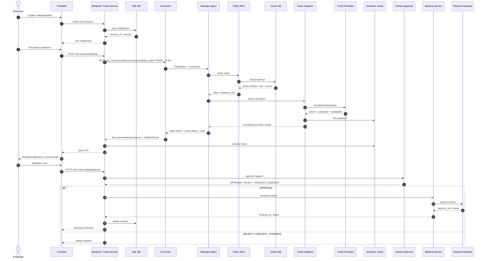

# Эволюция API: ДЗ 05 → ДЗ 07

## Зачем это нужно

ДЗ 07 не проектируется с нуля. Оно продолжает архитектуру ДЗ 05 и использует уже разработанный внутренний контракт Backend → AI Service.

В ДЗ 05 был зафиксирован стабильный AI endpoint:

```http
POST /get_recommendation
```

Он принимал `RecommendationRequest` и возвращал `RecommendationResponse` с `evidence_refs`, `confidence`, `limitations` и `research_gaps`.

В ДЗ 07 endpoint **не заменяется**, а расширяется для travel-домена:

- добавляется `recommendation_type = TRAVEL_PLAN`;
- в запросе появляется опциональный `travel_context`;
- в ответе появляется опциональный `domain_result = TripPlanResult`;
- все базовые поля ДЗ 05 остаются совместимыми.

Это показывает эволюцию архитектуры, а не набор несвязанных домашних заданий.

---

## Сквозная API-цепочка



---

## Две границы API

### 1. Frontend ↔ Backend

Доменные endpoints:

```text
POST /trip-missions
POST /trip-missions/{mission_id}/plan
POST /trip-missions/{mission_id}/approval
```

Они работают с сущностями бизнеса: `TripMission`, `Venue`, `TripPlan`, `Approval`.

### 2. Backend ↔ AI Service

Сохраняется контракт из ДЗ 05:

```text
POST /get_recommendation
```

Он остаётся доменно-независимым AI-контрактом и получает `travel_context` только когда `recommendation_type = TRAVEL_PLAN`.

---

## Почему это архитектурно полезно

1. **Backward compatibility.** Клиенты ДЗ 05 продолжают работать.
2. **Separation of concerns.** Backend хранит бизнес-сущности; AI Service выдаёт evidence-backed recommendation.
3. **Human-in-the-loop.** Approval и payment не выполняются AI-агентом.
4. **Traceability.** Каждая рекомендация сохраняет `request_id`, `trace_id`, `evidence_refs` и версию модели/prompts.
5. **Эволюция курса.** C4/API из ДЗ 05 становятся фундаментом multi-agent/RAG решения ДЗ 07.

---

## Артефакты

- ДЗ 05 OpenAPI: `../../5.../api/openapi.yaml` — исходный контракт `/get_recommendation`.
- ДЗ 07 OpenAPI: [`../api/openapi-travel.yaml`](../api/openapi-travel.yaml) — совместимое расширение v2.1.0.
- ДЗ 07 LangGraph: [`../src/travel_multiagent_demo.py`](../src/travel_multiagent_demo.py).
