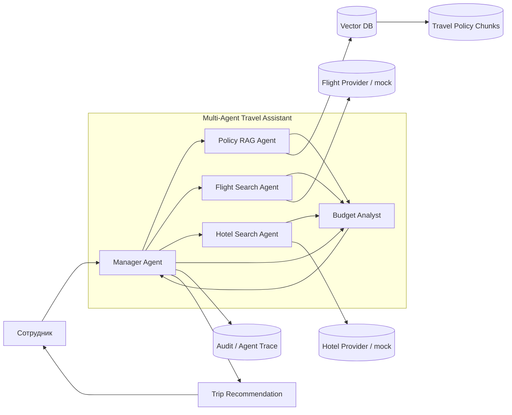

# Multi-Agent Architecture — Smart Travel Assistant

## Single Responsibility

| Агент | Ответственность | Не делает |
|---|---|---|
| **Manager Agent** | декомпозиция запроса, делегирование, сбор результата | не ищет билеты и не интерпретирует политику напрямую |
| **Policy RAG Agent** | поиск правил корпоративной политики и evidence refs | не бронирует и не рассчитывает итоговый бюджет |
| **Flight Search Agent** | подбор вариантов перелёта | не решает, допустим ли тариф по политике |
| **Hotel Search Agent** | подбор вариантов проживания | не утверждает превышение лимита |
| **Budget Analyst** | суммирование расходов и проверка лимитов | не меняет исходные результаты поиска |

## Паттерн взаимодействия

Используется **иерархическая мультиагентная схема**: Manager координирует специализированных агентов. Для минимального прототипа граф детерминирован и воспроизводим; в production-версии Manager может формировать динамический план и запускать независимые поисковые задачи параллельно.

## Безопасность и управляемость

- tools имеют allow-list;
- внешние поисковые агенты в демо используют mock/read-only источники;
- Policy RAG всегда возвращает `source_id/chunk_id`;
- отсутствие правила даёт `POLICY_GAP`;
- итоговая рекомендация не является автоматическим финансовым одобрением.