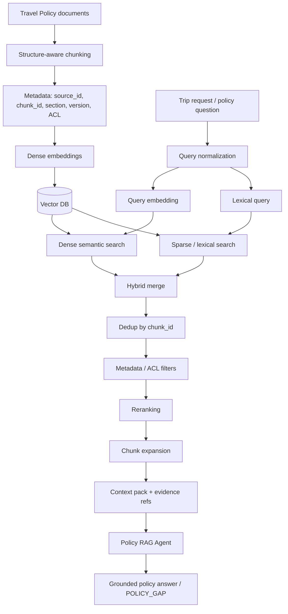

# RAG Flow — Corporate Travel Policy M1.1



## 1. Structure-aware chunking

Политика делится по смысловым разделам, а не по случайному числу символов. Каждый фрагмент получает стабильные поля:

```text
source_id
chunk_id
section
position
version
ACL
```

В демо соседние правила одного раздела (`flights`, `hotels`) сохраняют `position`, поэтому после основного retrieval можно выполнить **chunk expansion** и вернуть соседний контекст.

## 2. Embeddings и Vector DB

Production-контур предполагает embedding-модель и Vector DB (например, Pinecone / pgvector / совместимый индекс).

В offline-demo используется детерминированный `hash-embedding`. Это не production embedding и не замена Vector DB; он нужен только для воспроизводимого CI без API-ключа и сети.

## 3. Hybrid retrieval

M1.1 объединяет два сигнала:

1. **Dense semantic score** — cosine similarity локальных embeddings.
2. **Lexical score** — точное совпадение нормализованных терминов.

Добавлен лёгкий business-term bonus для доменных слов (`перелёт`, `гостиница`, `суточные`, `лимит`, `согласование`).

```text
hybrid_score = 0.55 * dense
             + 0.35 * lexical
             + 0.10 * business_term_bonus
```

Это помогает на запросах, где семантическая близость важна, но точные корпоративные термины, города и лимиты тоже нельзя потерять.

## 4. Нормализация запроса

Для русского demo добавлена небольшая alias-нормализация:

```text
отель / отеля → гостиница
Москва / Москве / Москвы → москва
перелет / перелёта → перелёт
согласования → согласование
```

Это демонстрирует проблему query normalization перед retrieval. В production вместо ручного словаря применимы морфологический анализ, query rewriting или доменный synonym dictionary.

## 5. Dedup и reranking

После hybrid merge:

1. кандидаты дедуплицируются по `chunk_id`;
2. сортируются по `hybrid_score`;
3. при равенстве учитываются lexical и dense score;
4. отбирается `top_k`.

Production-расширение: cross-encoder / LLM reranker.

## 6. Chunk expansion

После выбора primary hits добавляются соседние chunks того же раздела (`position ± 1`). Это позволяет не передавать модели изолированный фрагмент без необходимого контекста.

Пример:

```text
hit: POLICY-HOTEL-CAPITALS-001
     ↓ expand same section
context:
  POLICY-HOTEL-BASE-001
  POLICY-HOTEL-CAPITALS-001
```

## 7. Evidence / Grounding

Policy RAG Agent возвращает evidence refs с отдельными retrieval scores:

```json
{
  "source_id": "TRAVEL-POLICY-001",
  "chunk_id": "POLICY-HOTEL-CAPITALS-001",
  "score": 0.84,
  "dense_score": 0.71,
  "lexical_score": 0.75
}
```

Если релевантного правила недостаточно, production-поведение — `POLICY_GAP`, а не генерация отсутствующего правила.

## 8. Retrieval evaluation gate

Файл `data/rag_eval.json` содержит небольшой ground-truth набор запросов и ожидаемых `chunk_id`.

CI проверяет:

```text
HitRate@2 >= 0.80
MRR@2     >= 0.70
```

Это учебный smoke-gate, а не заявка на production quality.

## 9. Demo vs Production

| Слой | Demo | Production |
|---|---|---|
| Embeddings | deterministic hash embedding | dedicated embedding model |
| Vector store | in-memory policy chunks | Pinecone / pgvector / compatible Vector DB |
| Lexical | token overlap | sparse index / BM25-like retrieval |
| Reranking | deterministic hybrid score | cross-encoder / managed reranker |
| Expansion | adjacent section chunks | parent/child or document-aware expansion |
| Eval | 5 synthetic queries | versioned representative eval dataset |

## Первоисточники

- Pinecone — Retrieval-Augmented Generation: https://www.pinecone.io/learn/retrieval-augmented-generation/
- LangChain messages: https://reference.langchain.com/python/langchain/messages
