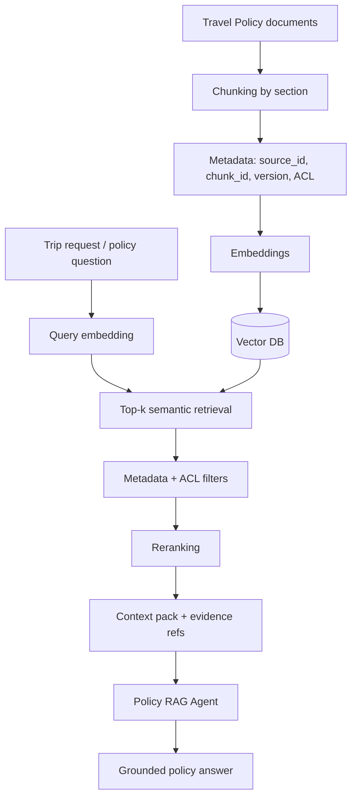

# RAG Flow — Corporate Travel Policy



## 1. Chunking

Политика делится по смысловым разделам и правилам, а не по случайному числу символов. Каждый фрагмент получает стабильный `chunk_id`, заголовок, версию документа и диапазон исходного текста.

## 2. Embeddings

Для production используется embedding-модель и Vector DB. В учебном offline-прототипе применяется детерминированный hash-embedding, чтобы пример запускался без API-ключа и внешнего сервиса.

## 3. Retrieval

1. embedding пользовательского запроса;
2. cosine similarity по индексированным chunks;
3. `top_k` кандидатов;
4. фильтры версии/ACL;
5. удаление дублей.

## 4. Reranking

Кандидаты переранжируются с учётом семантической близости и приоритета точного совпадения бизнес-термов (`hotel`, `flight`, `daily allowance`, `approval`). В production здесь может использоваться cross-encoder reranker.

## 5. Grounding

Policy RAG Agent возвращает не только текст правила, но и:

```json
{
  "source_id": "TRAVEL-POLICY-001",
  "chunk_id": "POLICY-HOTEL-001",
  "score": 0.91
}
```

Если релевантный фрагмент не найден выше минимального порога, результат — `POLICY_GAP`.

## 6. Контроль качества

- Recall@k;
- Precision@k;
- citation accuracy;
- groundedness;
- p95 retrieval latency;
- доля `POLICY_GAP`.
