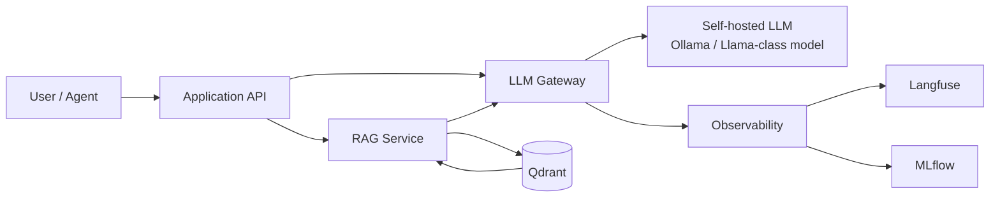

# ADR-001: Выбор способа хостинга LLM

- **Статус:** Accepted
- **Дата:** 2026-09-11
- **Контекст:** OTUS / архитектура AI-систем
- **Решение:** использовать Self-hosted Open-Source LLM как основной способ инференса в текущем проекте

## 1. Title

**ADR-001 — Self-hosted Open-Source LLM вместо проприетарной SaaS-модели как основной inference-контур текущего проекта.**

## 2. Status

**Accepted.**

Решение действует для текущего учебно-проектного контура и должно быть пересмотрено при изменении требований к качеству, нагрузке, SLA, безопасности или стоимости владения.

## 3. Context

В проекте необходимо выбрать основной вариант размещения LLM:

1. **Проприетарная SaaS-модель** — облачный API класса GPT-5.
2. **Self-hosted Open-Source модель** — модель класса Llama 3, развёрнутая на собственной инфраструктуре через локальный inference runtime.

Текущий проект уже использует локальный AI-стек:

- `Ollama` для локального инференса;
- `Qdrant` для векторного поиска;
- `MLflow` для экспериментов и метрик;
- `Langfuse` для наблюдаемости LLM-цепочек;
- отдельные контуры `rag/`, `testing/`, `agent/`.

Поэтому решение оценивается не абстрактно, а для уже существующей архитектуры, где локальный inference-контур является естественным продолжением текущей платформы.

### Архитектурные драйверы

Для выбора используются обязательные критерии задания:

- стоимость;
- безопасность данных (Privacy);
- качество ответов;
- latency;
- сложность поддержки.

Дополнительно учитываются:

- воспроизводимость экспериментов;
- контроль версии модели;
- vendor lock-in;
- возможность работы без внешнего API;
- возможность тестировать модель в CI/CD до публикации новой версии.

## 4. Рассмотренные варианты

### Вариант A — SaaS LLM

Приложение передаёт prompt/context внешнему API и получает ответ облачной модели.

**Сильные стороны:**

- высокое качество frontier-моделей;
- не требуется содержать GPU-инфраструктуру;
- масштабирование и обновление модели выполняет провайдер;
- минимальная операционная нагрузка на команду.

**Слабые стороны:**

- данные покидают локальный контур обработки;
- стоимость зависит от фактического использования API;
- зависимость от сети и доступности внешнего провайдера;
- изменение модели или политики провайдера контролируется не командой проекта;
- сложнее полностью воспроизводить исторический результат после изменения внешней модели.

### Вариант B — Self-hosted Open-Source LLM

Модель класса Llama 3 или совместимая open-source модель запускается локально через inference runtime, например Ollama.

**Сильные стороны:**

- prompt, retrieved context и результаты инференса можно оставить внутри собственного контура;
- отсутствует тарификация за каждый токен со стороны внешнего LLM API;
- команда контролирует версию модели и момент обновления;
- локальный inference можно тестировать, версионировать и воспроизводить;
- отсутствует обязательная зависимость от внешнего LLM API для основной функции;
- текущий проект уже содержит локальный inference-контур.

**Слабые стороны:**

- требуется GPU/CPU/RAM и дисковое пространство;
- команда отвечает за runtime, модели, обновления, мониторинг и capacity planning;
- frontier SaaS-модель может давать лучшее качество на сложных reasoning-задачах;
- пропускная способность ограничена имеющимся железом;
- масштабирование требует дополнительных вычислительных ресурсов.

## 5. Сравнение вариантов

Оценка ниже относится **только к текущему проекту**, а не является универсальной оценкой всех SaaS и Self-hosted решений.

| Критерий | SaaS LLM | Self-hosted LLM | Вывод для проекта |
|---|---|---|---|
| **Стоимость** | Нет собственного GPU CAPEX, но переменные расходы растут вместе с количеством запросов/токенов | Требуются собственные ресурсы, зато нет внешней per-token тарификации основного инференса | При уже имеющемся локальном контуре Self-hosted обеспечивает более предсказуемую стоимость экспериментов |
| **Privacy** | Prompt и context передаются внешнему провайдеру в соответствии с его договорными и техническими условиями | Prompt/context могут оставаться в локальном контуре | **Self-hosted предпочтительнее** для контролируемой обработки данных |
| **Качество** | Frontier SaaS обычно является сильным вариантом для сложных reasoning-задач | Качество зависит от выбранной open-source модели, квантизации и оборудования | **Преимущество SaaS**, поэтому нужен quality gate |
| **Latency** | Есть сетевой RTT; backend провайдера обычно хорошо масштабирован | Нет внешнего сетевого RTT, но скорость зависит от локального GPU и размера модели | Для одиночной локальной нагрузки Self-hosted удобен; при высокой нагрузке преимущество может измениться |
| **Сложность поддержки** | Низкая: инфраструктуру модели обслуживает провайдер | Выше: runtime, GPU, модели, обновления, мониторинг | **Преимущество SaaS** |
| **Контроль версии** | Ограничен возможностями API провайдера | Полный контроль конкретной модели и артефакта | **Self-hosted** |
| **Воспроизводимость** | Может зависеть от изменений внешнего сервиса | Версию модели можно зафиксировать вместе с конфигурацией | **Self-hosted** |
| **Vendor lock-in** | Выше при использовании специфичного API/поведения модели | Ниже при наличии собственного LLM Gateway и сменных open-source моделей | **Self-hosted** |

## 6. Decision

**Выбрать Self-hosted Open-Source LLM как основной inference-контур текущего проекта.**

Базовая схема:

Ключевое архитектурное правило: прикладной код не должен зависеть напрямую от конкретной модели. Все обращения к модели проходят через **LLM Gateway**, чтобы сохранить возможность замены runtime/model без переписывания бизнес-логики.

SaaS LLM не объявляется запрещённым. Он остаётся потенциальным альтернативным backend для отдельных задач после отдельного security/cost/quality review, но **не является основным inference-контуром текущего решения**.

## 7. Consequences

### Положительные последствия

1. **Privacy by architecture.** Основной prompt/context не обязан покидать локальную инфраструктуру.
2. **Контроль версии модели.** Можно зафиксировать точный model artifact и reproducible configuration.
3. **Предсказуемость экспериментов.** Для локальной учебной и тестовой нагрузки нет внешней тарификации каждого LLM-запроса.
4. **Интеграция с текущим стеком.** Уже используются Ollama, Qdrant, MLflow и Langfuse; не требуется вводить принципиально новый runtime-контур.
5. **Снижение lock-in.** LLM Gateway позволяет менять open-source модель без изменения внешнего API приложения.
6. **Контроль обновлений.** Новая модель попадает в production только после тестов качества.
7. **Offline/degraded mode.** Основной inference может продолжать работать при недоступности внешнего LLM API.

### Отрицательные последствия / Trade-offs

1. **Ниже потенциальный ceiling качества.** На сложных reasoning-задачах open-source модель может уступать frontier SaaS.
2. **Инфраструктурная ответственность переходит к команде.** Нужно обслуживать runtime и оборудование.
3. **Capacity ограничен железом.** Рост числа параллельных пользователей может потребовать дополнительных GPU.
4. **Обновление моделей — наша задача.** Необходимы regression/evaluation тесты перед сменой версии.
5. **Высокая доступность сложнее.** Отказ локальной машины/GPU влияет на inference, если нет резервного узла.
6. **Энергопотребление и амортизация железа становятся частью TCO.** Отсутствие per-token API fee не означает бесплатный inference.

## 8. Риски и меры снижения

| Риск | Последствие | Mitigation |
|---|---|---|
| Качество локальной модели ниже требуемого | Неполные или ошибочные ответы | Golden dataset + RAGAS/LLM evaluation + quality gate до смены модели |
| GPU недоступен | Остановка или деградация inference | health-check, restart policy, резервный backend как отдельное решение |
| Перегрузка GPU | Рост latency | queue, concurrency limits, batching, capacity monitoring |
| Неуправляемое обновление модели | Регресс качества | pin model version + controlled rollout + regression tests |
| Ошибки в prompt/RAG | Hallucination/low faithfulness | evaluation pipeline, faithfulness/relevancy metrics, tracing |
| Сложность эксплуатации растёт | Увеличение технического долга | стандартизированный runtime, IaC/Compose, runbook, monitoring |

## 9. Когда ADR должен быть пересмотрен

ADR переводится в `Superseded` или `Amended`, если выполняется хотя бы одно условие:

- локальная модель систематически не проходит утверждённый quality gate;
- нагрузка становится выше экономически оправданной мощности локальной инфраструктуры;
- появляется требование к SLA/HA, которое текущий self-hosted deployment не способен обеспечить;
- стоимость владения локальным inference становится выше допустимого бюджета;
- требования по privacy допускают внешний inference и SaaS даёт измеримое преимущество;
- SaaS используется как основной backend и это подтверждено новой сравнительной оценкой.

## 10. CTO Pitch

**Предлагаю зафиксировать Self-hosted LLM как основной inference-контур текущего проекта, потому что это единственный вариант, который одновременно использует уже построенный локальный стек, оставляет prompt и RAG-контекст под нашим контролем, позволяет фиксировать и воспроизводить версию модели и не привязывает базовую работу системы к внешней per-token тарификации и доступности API. Мы сознательно принимаем два существенных минуса — более высокую операционную сложность и возможный разрыв в качестве с frontier SaaS — и закрываем их LLM Gateway, quality gate, MLflow/Langfuse и регрессионным тестированием. Если измерения покажут, что локальный вариант перестал удовлетворять качеству, SLA или TCO, ADR будет пересмотрен; до этого момента Self-hosted является наиболее обоснованным решением для текущих условий.**

## 11. Подготовка к CTO Challenge

### Почему не SaaS, если качество обычно выше?

Потому что решение выбирается не только по максимальному качеству модели. В текущем проекте важны локальный контур данных, воспроизводимость, контроль версии и уже существующая self-hosted инфраструктура. Разрыв качества проверяется тестами, а не предположением.

### Не получится ли Self-hosted дороже?

Может получиться. Self-hosted переносит стоимость из API usage в оборудование, электроэнергию и эксплуатацию. Поэтому ADR не утверждает, что локальный inference всегда дешевле; он утверждает, что при текущем масштабе и существующем локальном стеке он даёт более контролируемую модель расходов. При росте нагрузки TCO должен быть пересчитан.

### Что будет при отказе GPU?

Это один из принятых рисков. Минимальная мера — health-check и restart; для production SLA потребуется резервный inference node либо отдельно согласованный fallback backend.

### Что делать, если локальная модель не решает сложный запрос?

Не скрывать проблему. Запрос фиксируется как quality gap. После измерения можно добавить более сильную локальную модель или вынести отдельный класс задач на внешний backend через LLM Gateway. Это будет новым архитектурным решением, а не незаметным обходом ADR.

### Почему решение не привязывает систему к Ollama?

Ollama — runtime, а не бизнес-контракт. Приложение должно работать через собственный LLM Gateway. Поэтому runtime можно заменить без изменения прикладного API.

### Как доказать решение на ревью?

Показать:

1. работающий локальный inference;
2. RAG через Qdrant;
3. трассу запроса в Langfuse;
4. метрики/эксперимент в MLflow;
5. один и тот же evaluation dataset для локальной и SaaS-модели;
6. сравнительный quality/latency/cost report;
7. перечень рисков и условия пересмотра ADR.

## 12. Итог

Решение **Accepted**: основной inference-контур — **Self-hosted Open-Source LLM**. SaaS сохраняется как возможная будущая альтернатива/дополнительный backend, но его использование в качестве основного варианта требует нового ADR или изменения этого решения.
