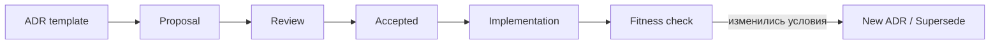

# ADR Tooling: практический каталог

Источник содержит широкий перечень решений и прямо предупреждает, что статус и зрелость каждого инструмента необходимо проверять отдельно. Поэтому инструменты ниже не считаются автоматически одобренными зависимостями FATHER.

## Категории

| Задача | Инструменты из каталога | Применение |
|---|---|---|
| Создание ADR разных форматов | ADG, dotnet-adr, adr.zone | Генерация и ведение записей |
| MADR lifecycle | pyadr, adr-log, ADR Manager | Создание, индекс, статусы и superseding |
| Работа в VS Code | ADR Manager VS Code Extension | Редактирование рядом с кодом |
| Публикация и поиск | Log4brains, Backstage ADR plugin, adr-viewer | Витрина и навигация по решениям |
| Nygard ADR | adr-tools и порты для PowerShell, Python, Go, Node.js | CLI-процесс в нужной ОС |
| Architecture as Code | ArchUnit, docToolchain, Structurizr | Проверка правил, документация и C4 |

## Рекомендуемый путь для OTUS/FATHER

### M0 — без внешних зависимостей

- хранить ADR в `docs/decisions/`;
- использовать `NNNN-title-with-dashes.md`;
- создавать записи копированием `ADR-TEMPLATE.md`;
- проверять Markdown в code review;
- вести `README.md` как индекс.

Причина: сначала закрепляется процесс принятия решений, а не конкретный инструмент.

### M1 — локальная автоматизация

- добавить PowerShell-скрипт создания следующего номера ADR;
- генерировать индекс решений;
- запускать markdownlint;
- проверять обязательные поля front matter;
- запрещать дублирование ID.

### M2 — CI и архитектурные fitness functions

- ADR-lint в GitHub Actions;
- проверка ссылок `ADR ↔ requirement ↔ risk ↔ test`;
- публикация каталога ADR как сайта;
- ArchUnit или аналог для проверяемых ограничений кода;
- Structurizr для связи решений с C4-моделью;
- правило PR: архитектурное изменение требует нового/обновлённого ADR либо обоснованного исключения.

## Проверка инструмента перед включением

1. Лицензия совместима с проектом.
2. Есть свежие релизы и активность сопровождения.
3. Нет известных критических уязвимостей.
4. Инструмент поддерживает используемый формат ADR.
5. Возможен экспорт в обычный Markdown без vendor lock-in.
6. Есть Windows-совместимость либо работа в CI/Linux.
7. Польза автоматизации превышает стоимость сопровождения.

## Целевой поток

## Минимальный стандарт FATHER

- исходником всегда остаётся Markdown в Git;
- любой UI или CLI является вспомогательным;
- ADR имеет владельца, статус, дату пересмотра и подтверждающий тест;
- старое решение не стирается;
- каталог инструментов пересматривается перед каждым серьёзным внедрением.
