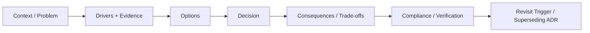

# OTUS Lesson 08 — FATHER OSINT Agent / ADR

**Project:** `VictorKVS/OSINT_deepseek`  
**Status:** `PASS FOR DOCUMENTATION DISCIPLINE`

The existing project already had an Architecture Decision Register. Lesson 08 adds standalone immutable ADRs without rewriting that history.

## ADR lifecycle

## ADR threshold

Standalone ADR is required for decisions that are costly/risky to reverse, change trust boundaries/external dependencies, affect several components/products, select a long-lived technology/provider, or materially affect security/data/cost/operations.

## First formalized ADRs

- `ADR-0001` — OSINT is an evidence supplier, not final truth authority;
- `ADR-0002` — source observation identity remains separate from reusable raw payload storage;
- `ADR-0003` — follow-up research is bounded and cumulative;
- `ADR-0004` — LLM hosting policy is intentionally deferred to Lesson 09 / CTO Challenge.

The first three are marked `ACCEPTED_RETROSPECTIVE` because the decisions were already evidenced in the existing project before this course pass.

## ADR template

Each material ADR records:
- Context/Problem;
- drivers and constraints;
- exact evidence;
- options;
- Decision;
- WHY;
- positive/negative consequences;
- risks;
- compliance/verification;
- rollback/replacement path;
- revisit triggers;
- traceability.

## Rule

Accepted ADR history is never silently overwritten. Changed decision → new ADR + `SUPERSEDED` link.

## What should be improved

| Priority | Improvement |
|---|---|
| P1 | migrate only material historic decisions from the old register into standalone ADRs |
| P1 | add ADR links to requirements, risks, PoC, tests and operational evidence |
| P2 | generate ADR index/timeline automatically from metadata later |
| P1 | use Lesson 09 as first forward-looking ADR created from options/trade-off evidence |

Detailed pack: `OSINT_deepseek/docs/course_live_reproduction/08_adr/`.
