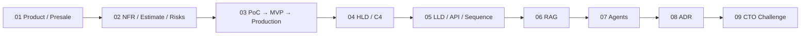
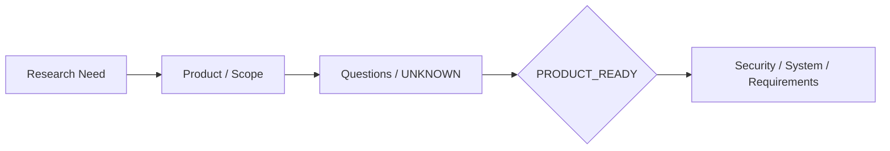
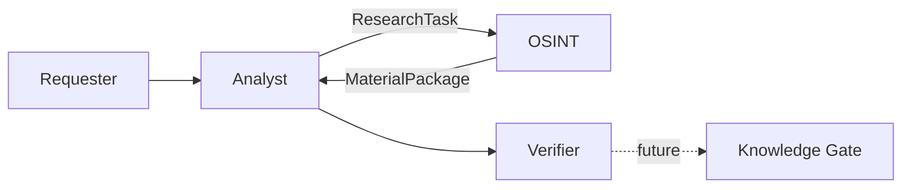
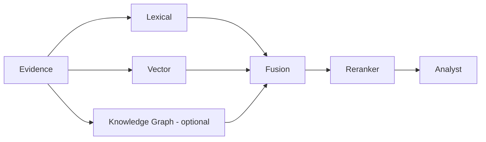

# FATHER OSINT Agent — канонический review ДЗ 01–09

**Проект:** `VictorKVS/OSINT_deepseek`  
**Режим:** один реальный проект проходит через уроки 01–20  
**Статус:** `READY FOR HUMAN REVIEW BEFORE LESSON 09 SUBMISSION`

Этот документ — учебное зеркало канонического project review из `OSINT_deepseek`. Подробные проектные артефакты остаются в проектном репозитории; здесь — компактный, но полный рассказ о том, как один OSINT Agent проходит уроки 01–09.

---

## Сквозная логика

| Lesson | Main result | Status |
|---|---|---|
| 01 | Product/Presale baseline + Product Ready | `CONDITIONAL_PASS` |
| 02 | NFR/Estimate/Risk/TCO/Change layer | `CONDITIONAL_PASS` |
| 03 | PoC→MVP→Production strategy | `CONDITIONAL_PASS` |
| 04 | C1/C2/HLD drivers | `CONDITIONAL_PASS` |
| 05 | C3/Sequence/API candidate | `CONDITIONAL_PASS` |
| 06 | Hybrid RAG candidate | `EVAL REQUIRED` |
| 07 | Agent/Multi-Agent candidate | `VALUE + SECURITY PROOF REQUIRED` |
| 08 | ADR discipline + ADR-0001..0003 | `PASS` |
| 09 | Hosting ADR + CTO Challenge | `READY FOR HOMEWORK REVIEW` |

---

## 01. Пресейл и требования

Восстановлен продуктовый фундамент существующего OSINT Agent: Business Need, Vision, stakeholders/authority, scope, success metrics, assumptions/UNKNOWN и Product Ready Decision.

OSINT Agent определён как **поставщик evidence и provenance**, а не финальная машина истины.

`PRODUCT_READY = CONDITIONAL_PASS`: миссия и границы доказаны, Production KPI/Legal/Data/SLO/TCO ещё требуют подтверждения.

---

## 02. Требования → оценка → риски → стоимость

Создан bridge между требованиями и архитектурой:

`Requirements → measurable NFR → WBS v0 → Estimate v0 → Project Risks → TCO Inputs → Change Control`.

Estimate v0 описывает масштаб и неопределённость до выбора архитектуры; Estimate v1 должен появляться после архитектурного решения. Числовые цели из учебных примеров не переносятся в проект без evidence.

Ключевой незакрытый слой — Production baseline latency/throughput/freshness/availability/cost.

---

## 03. PoC → MVP → Production

Проект разделён по смыслу стадий:

- PoC отвечает «технически возможно?»;
- MVP — «полезно реальному пользователю?»;
- Production — «можно безопасно и устойчиво эксплуатировать?».

Текущий DEV baseline подтверждён, TDLib/Telegram идёт как evidence-producing technical PoC, реальный MVP ещё не выбран Product Owner, Production readiness не заявляется.

---

## 04. HLD / C4

Существующая архитектура нормализована в C1/C2.

C2 разделяет Acquisition, Research Orchestration, Evidence Persistence, Analysis и Review. Конкретные DB/queue/LLM не выбираются раньше архитектурного решения.

---

## 05. LLD

C3 построен вокруг существующих компонентов: `ResearchTask`, `OSINTAgent`, `Collector`, `Material`, `MaterialStore`, `MaterialPackage`.

Задокументированы success/failure/follow-up sequences. Candidate OpenAPI создан только как будущий adapter и не выдаётся за существующий runtime API.

Особый инвариант: одинаковый payload может переиспользоваться, но независимые source observations не исчезают.

---

## 06. RAG

RAG размещается после evidence acquisition, а не внутри OSINT collector.

Зрелость предлагается наращивать последовательно: lexical → vector → hybrid → reranker → graph только если он доказал дополнительную ценность.

`Similarity ≠ truth`, `retrieved content ≠ instruction`, `generated answer ≠ evidence`.

---

## 07. AI Agents / Multi-Agent

Существующие роли превращены в candidate agent architecture:

`Manager/Analyst → OSINT Research Agent → Tools/Collectors → Evidence/RAG → Verifier/Socrates → Human/Knowledge Gate`.

Каждый handoff должен переносить task/trace ID, objective, scope, allowed tools, budget/limits, evidence refs, stop condition и privilege ceiling.

Архитектура сразу учитывает prompt injection, tool abuse, runaway loops, confused deputy и cross-agent privilege escalation.

---

## 08. ADR

Из реальных решений проекта оформлены ADR:

- ADR-0001 — OSINT является evidence supplier, не финальным экспертом;
- ADR-0002 — source observation и stored payload различаются;
- ADR-0003 — follow-up research bounded и cumulative.

Правило: `Context → Alternatives → Evidence → Decision → Consequences → Verification → Revisit trigger`. Старые решения не переписываются — новое решение supersedes старое.

---

## 09. CTO Challenge / LLM Hosting

Сравнены Hosted API, Self-hosted Cloud GPU, On-prem GPU и Hybrid.

Текущее решение: **для PoC/MVP semantic-функций использовать hosted API за replaceable Model Gateway только для данных, разрешённых к внешней обработке; sensitive/unclassified evidence наружу не отправлять; финальный Production hosting выбор отложить до измеренных quality/workload/SLO/TCO.**

Почему не выбираем on-prem заранее: пока нет доказанных requests/month, token profile, peak concurrency, p95/SLO, local-model quality, GPU utilization, current prices и ops cost.

CTO pitch: сейчас выгоднее купить **знание о реальной нагрузке и качестве**, чем заранее купить инфраструктуру. Gateway сохраняет reversibility, а следующий ADR появится после накопления telemetry.

---

## Что доказано / что пока нет

| Уже поддержано evidence | Ещё требует evidence |
|---|---|
| bounded OSINT contract и role separation | конкретный внешний MVP + KPI |
| provenance как инвариант | Production workload/SLO |
| DEV ≠ Production | Legal/Data external-processing matrix |
| HLD/LLD responsibility model | final deployment topology |
| ADR discipline | final Production LLM hosting winner |
| candidate RAG/agent architecture | их Production value/quality/security |

---

## Следующие приоритеты

`P0`: Legal/Data applicability + external-processing policy; tool/untrusted-content policy до executable agents.  
`P1`: выбрать реальный MVP; Production NFR baseline; versioned Eval/Golden Dataset; Model Gateway contract; measured hosted-vs-local benchmark + TCO; independent review material ADR.

---

## Итог

После 9 уроков получился не набор учебных файлов, а один инженерный путь:

`бизнес-потребность → требования → оценимость → PoC → HLD → LLD → RAG → Agents → ADR → CTO Challenge`.

Архитектура уже объяснима и защищаема, но Production readiness сознательно не заявляется раньше evidence из следующих уроков и реальной эксплуатации.

**Canonical source:** `VictorKVS/OSINT_deepseek/docs/course_live_reproduction/CANONICAL_DZ_REVIEW_01_09.md`, branch `feature/otus-live-reproduction-01-20`.
