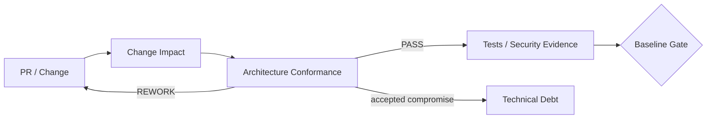
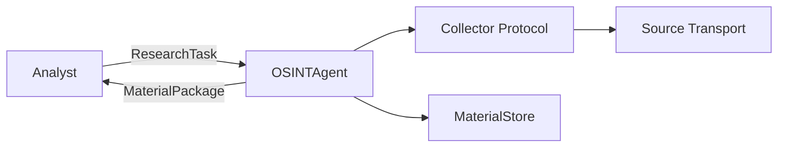
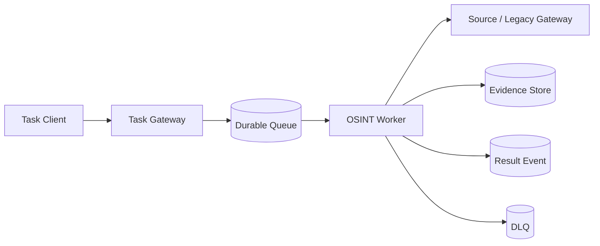
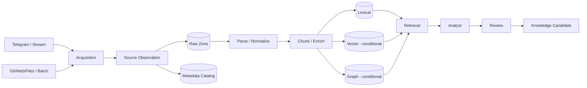

# FATHER OSINT Agent — канонический review ДЗ 01–12

**Project:** `VictorKVS/OSINT_deepseek`  
**Mode:** one living project across OTUS Lessons 01–20  
**Status:** `LESSONS 01–12 DOCUMENTED / READY FOR HUMAN REVIEW`

This file is the course-facing mirror. Canonical engineering artifacts remain in `OSINT_deepseek/docs/course_live_reproduction/`.

## Сквозная логика

| Lesson | Main result | State |
|---|---|---|
| 01 | Product/Presale baseline | `CONDITIONAL_PASS` |
| 02 | NFR/WBS/Estimate/Risk/TCO | `CONDITIONAL_PASS` |
| 03 | PoC→MVP→Production strategy | `CONDITIONAL_PASS` |
| 04 | C1/C2 HLD | `CONDITIONAL_PASS` |
| 05 | C3/Sequence/API candidate | `CONDITIONAL_PASS` |
| 06 | Hybrid RAG candidate | `EVAL REQUIRED` |
| 07 | Agent/Multi-Agent candidate | `SECURITY + VALUE PROOF REQUIRED` |
| 08 | ADR discipline | `PASS` |
| 09 | Hosting ADR + CTO Challenge | `READY FOR REVIEW` |
| 10 | Architecture governance + debt | `CONDITIONAL_PASS` |
| 11 | Integration architecture | `CONDITIONAL_PASS` |
| 12 | Data architecture + governance | `CONDITIONAL_PASS` |

## 01–09: foundation to architecture decision

Lessons 01–09 create a coherent chain:

`Business Need → Product/Scope → Requirements/NFR → Estimate/Risk/TCO → PoC/MVP/Prod gates → HLD → LLD → RAG → Agents → ADR → CTO Challenge`.

Key current-stage decisions remain unchanged:

- OSINT is an evidence/provenance supplier, not final truth authority;
- source observation identity is preserved independently of raw payload reuse;
- RAG and Multi-Agent layers are candidates, not claimed Production features;
- current semantic PoC/MVP policy prefers hosted LLM behind replaceable Model Gateway only for data approved for external processing;
- final Production hosting waits for measured quality/workload/SLO/TCO.

## 10. Architectural Governance & Technical Debt

Lesson 10 asks how implementation remains aligned with approved architecture after ADRs exist.

Material review checks requirement fit, C4/C3 boundaries, interfaces/data, provenance, security, dependencies, operability, test obligations and ADR impact.

Current debt is separated from defects/features/risks. Examples: local JSONL/file DEV persistence, deterministic Analyst/Reviewer harnesses, manually synchronized Mermaid views and duplicated course mirror prose.

Historic provenance/dedup failure is not carried as debt because the current store already preserves observations independently from reused payloads.

`LESSON_10_GOVERNANCE = CONDITIONAL_PASS`.

## 11. Integration Architecture

Current DEV remains intentionally direct:

Telegram already demonstrates replaceability: `TelegramCollector` depends on a transport-neutral `TelegramTransport` boundary.

A broker path is only a candidate for long-running/durable work:

Required semantics: task identity, bounded retry/backoff, idempotency, checkpoint-after-save, backpressure, failure isolation, auth/data-policy propagation and trace/audit IDs.

Applicability:
- HTTP/REST — external task/status/result API candidate;
- gRPC — typed internal service candidate;
- Message Broker — durable async candidate;
- ETL/ELT — batch/backfill/data preparation;
- MCP — future controlled model/tool boundary;
- A2A — future independently deployed agent coordination;
- ONNX — model portability, not the integration bus.

`LESSON_11_INTEGRATION_ARCHITECTURE = CONDITIONAL_PASS`.

## 12. Data Architecture for AI Systems

The OSINT/Knowledge Factory pipeline is normalized into a raw-first data architecture.

Storage selection is role-based:

| Data role | Storage class |
|---|---|
| raw/original evidence | object storage / Data Lake candidate |
| operational metadata | relational DB / metadata catalog |
| lexical retrieval | search index |
| semantic retrieval | Vector index only after eval |
| relation traversal | graph store only if justified |
| eval/training datasets | versioned object/lakehouse registry |
| telemetry analytics | warehouse/lakehouse when required |
| shared offline/online ML features | Feature Store conditionally |

Current decision: `FEATURE_STORE = NOT_REQUIRED_FOR_CURRENT_CORE` because the verified OSINT core does not yet have a supervised online-feature-serving requirement.

Training-serving skew control, when needed:

`canonical feature definition → versioned transformation → point-in-time correct offline value → same online definition → feature/model version trace`.

RAG has an analogous consistency problem: chunker/embedding/index/config generations must match evaluation and serving.

Lineage:

`source → observation → raw hash/file → parser → chunk → embedding/extraction/index → retrieval → claim/relation → review → knowledge gate`.

`LESSON_12_DATA_ARCHITECTURE = CONDITIONAL_PASS`.

## Что уже доказано / что остаётся открытым

| Supported now | Still needs evidence |
|---|---|
| bounded OSINT contract and provenance | Product MVP + KPI |
| HLD/LLD responsibility model | final deployment topology |
| ADR + architecture governance | automated conformance enforcement |
| transport-neutral integration boundary | actual need for broker/API/MCP/A2A |
| raw-first lineage model | Production storage product choices |
| current DEV store semantics | retention/deletion/legal matrix |
| conditional RAG/agent designs | Production quality/security/value |
| Feature Store applicability decision | first approved model requiring shared features |

## Главные следующие шаги

**P0:** Production Legal/Data applicability; data classification/retention/deletion/external processing; tool/privilege/untrusted-content policy before executable agents.

**P1:** Production NFR; real MVP; versioned Eval/Golden Dataset; architecture-as-code/conformance automation; integration reliability NFR; versioned event schemas if async path is promoted; dataset/index version registry; lineage validation; stage data-quality telemetry; retrieval/storage benchmarks.

## Итог

После урока 12 проект уже проходит путь:

`потребность → требования → оценимость → PoC/MVP/Prod → HLD → LLD → RAG → Agents → ADR → CTO Challenge → Governance → Integrations → Data Architecture`.

Architecture is now not only explainable but maintainable over time: material changes can be checked for conformance, integration mechanisms remain replaceable, and data derivatives have an explicit lineage/version/governance model.

**Canonical source:** `VictorKVS/OSINT_deepseek/docs/course_live_reproduction/CANONICAL_DZ_REVIEW_01_12.md`, branch `feature/otus-live-reproduction-01-20`.
