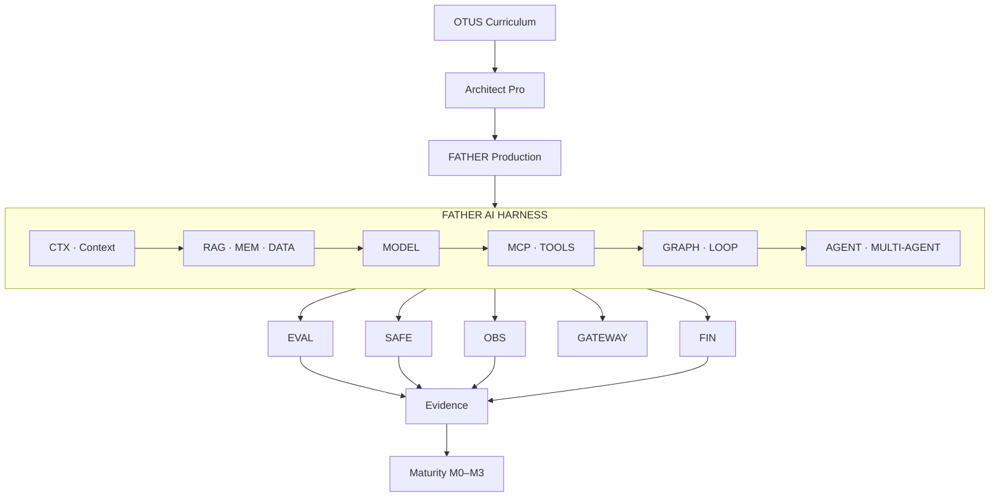

# STEP 00 — Архитектурная нотация и визуальный язык FATHER Architect OS

Статус: **ACTIVE STANDARD**  
Ветка: `feature/otus-homework-site`  
Назначение: единый визуально-инженерный язык для всех 31 урока OTUS, слоя Architect Pro и боевой реализации FATHER Production.

## 1. Обязательный порядок представления каждого шага

Каждый урок, capability, архитектурный модуль и этап развития публикуется в одинаковом порядке:

`СХЕМА → ВИЗУАЛ → СМЫСЛ → АРТЕФАКТЫ → ПРОВЕРКИ → FATHER MAPPING → ЗРЕЛОСТЬ`

Текст без схемы допускается как рабочая заметка, но не считается завершённой страницей сайта.

## 2. Три слоя каждой темы

1. **OTUS Curriculum** — что дано в программе/уроке и что требуется выполнить.
2. **Architect Pro** — профессиональное расширение: методики, стандарты, trade-offs, шаблоны, anti-patterns.
3. **FATHER Production** — конкретный рабочий модуль платформы, его контракты, runtime, evidence и эксплуатация.

Трассировка обязательна:

`OTUS → Architect Pro → FATHER Production`

## 3. Базовые типы сущностей

### Business / Product
- `BUS` — бизнес-цель.
- `VAL` — измеримая ценность/outcome.
- `REQ` — функциональное требование.
- `NFR` — требование качества.
- `ASM` — допущение.
- `RISK` — риск.
- `COST` — стоимость/бюджет.

### Architecture
- `ADR` — архитектурное решение.
- `CMP` — компонент.
- `INT` — интеграция.
- `DATA` — данные/хранилище.
- `FLOW` — поток/сценарий.
- `CTRL` — контроль/ограничение.

### AI Engineering
- `CTX` — context engineering.
- `PROMPT` — prompt/template.
- `RAG` — retrieval/RAG pipeline.
- `MEM` — memory layer.
- `MODEL` — модель/model endpoint.
- `AGENT` — агент.
- `MCP` — MCP/tool integration.
- `GRAPH` — workflow/graph/loop.
- `EVAL` — evaluation.
- `SAFE` — guardrails/safety.
- `OBS` — observability.
- `GATEWAY` — AI/model gateway.
- `FIN` — FinOps/cost control.
- `SYN` — synthetic data.
- `FT` — fine-tuning/distillation.
- `HARNESS` — общий execution harness/runtime envelope.

### Delivery / Operations
- `TEST` — проверка.
- `DEPLOY` — поставка/развёртывание.
- `SLO` — эксплуатационная цель.
- `RUN` — runtime.
- `INC` — инцидент/postmortem.
- `REL` — релиз.

## 4. Типы связей

- `A → B` — ведёт к / преобразуется в.
- `A ⇒ B` — определяет или требует.
- `A ⇄ B` — двусторонняя связь.
- `A ⊂ B` — входит в состав.
- `A ↦ B` — трассируется в.
- `A ⚠ B` — создаёт/изменяет риск.
- `A ✓ B` — подтверждается проверкой/evidence.

## 5. Сквозная архитектурная цепочка

`BUS → REQ/NFR → RISK → ADR → CMP/INT/DATA → CTRL/SAFE → TEST/EVAL → SLO/OBS → COST/FIN → DEPLOY/RUN → REL`

Для AI-систем поверх неё накладывается capability chain:

`CTX → RAG/MEM → MODEL → MCP/TOOLS → GRAPH/AGENT → EVAL/SAFE → OBS → GATEWAY → FIN`

## 6. Уровни зрелости

- **M0 — MATERIALS:** есть исходники/идея, нет проверяемого результата.
- **M1 — DESIGN:** есть схема, решение и минимальный воспроизводимый артефакт.
- **M2 — PRO:** есть владельцы, источники, альтернативы, риски, метрики и traceability.
- **M3 — PRODUCTION:** есть автоматизация, тесты, policy/guardrails, observability, deployment/rollback и эксплуатационные evidence.

## 7. Визуальная семантика сайта

Цвет является вспомогательным каналом и не должен быть единственным носителем смысла.

- архитектура/решения — синий;
- validated/done — зелёный;
- review/transition — жёлтый;
- risk/problem — красный;
- AI/models/agents — фиолетовый;
- knowledge/RAG/memory — бирюзовый;
- cost/FinOps/constraints — оранжевый.

Рекомендуемая форма:
- прямоугольник — сущность/компонент;
- скруглённый блок — процесс/workflow;
- ромб — decision/gate;
- шестигранник — AI capability;
- цилиндр — storage;
- щит — security/guardrails;
- глаз — observability;
- монета — cost/FinOps.

## 8. Capability Map 2026

В боевой план включаются:

- Harness / execution runtime;
- Context Engineering;
- Prompt Optimization;
- Loop Engineering;
- Graph Engineering;
- MCP и stateless MCP;
- Tool Use / Function Calling;
- Agentic AI;
- Multi-Agent Systems;
- RAG 2.0;
- Memory Layers;
- Vector DB;
- Fine-tuning;
- Distillation;
- Evaluation Frameworks;
- Guardrails;
- Observability;
- Synthetic Data;
- AI Gateways;
- Cost Optimization.

Обязательные production-блоки сверх capability checklist:

- IAM / RBAC / ABAC;
- Secrets management;
- Policy Engine;
- Data Governance / provenance / lineage;
- Human approval / review;
- Artifact & Model Registry;
- CI/CD;
- deployment strategies / rollback;
- HA/DR;
- threat modeling;
- audit trail;
- capacity/sizing;
- incident/postmortem lifecycle.

## 9. Мастер-схема STEP 00

## 10. Definition of Done для любой страницы

Страница шага завершена только если:

- есть инженерная схема;
- есть визуальная версия для быстрого восприятия;
- явно разделены OTUS / Architect Pro / FATHER Production;
- перечислены входы и выходные артефакты;
- заданы проверки/evidence;
- есть traceability до соседних шагов;
- указан уровень зрелости;
- отсутствующие факты помечены GAP/UNKNOWN, а не додуманы;
- ссылка на исходные материалы/репозиторий работает.

Этот документ является STEP 00 и базовым контрактом всех следующих страниц.
