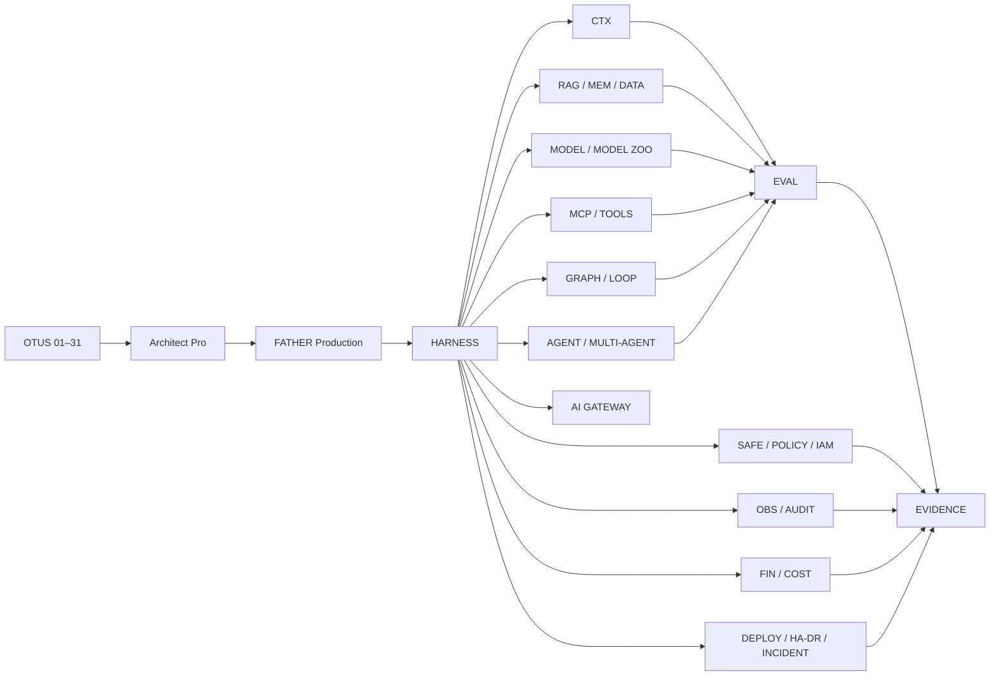
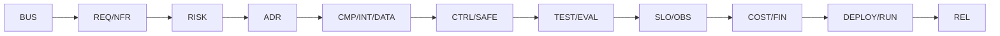

# STEP 01 — Master Architecture Map

Статус: **DONE v1**  
Основание: [STEP 00](STEP_00_NOTATION_AND_VISUAL_LANGUAGE.md)

## 1. Цель

Создать одну мастер-карту, которая одновременно показывает:

- 31 урок OTUS как образовательный маршрут;
- Architect Pro как профессиональный слой;
- FATHER Production как боевую платформу;
- AI capabilities 2026;
- production capabilities, без которых AI-система не считается боевой;
- сквозную traceability от бизнес-цели до эксплуатации и релиза.

## 2. Контекстная схема

## 3. Сквозная traceability

## 4. Capability domains

| Domain | Capabilities | FATHER target |
|---|---|---|
| Context | Context Engineering, Prompt Optimization | Context Builder / Prompt Registry |
| Knowledge | RAG 2.0, Vector DB, provenance | Knowledge Service / Retrieval Gateway |
| Memory | Session/project/agent/org memory | Memory Service |
| Models | Local/cloud models, fine-tuning, distillation | Model Zoo / Model Registry |
| Tools | Function Calling, MCP, stateless MCP | Tool Registry / MCP Gateway |
| Orchestration | Loop + Graph Engineering | Workflow/Graph Engine |
| Agents | Agentic AI, Multi-Agent | Agent Zoo / Supervisor / Handoff |
| Quality | Evaluation Frameworks, golden sets | Eval Service / Quality Gates |
| Safety | Guardrails, IAM, Policy, Secrets | Policy/Security Plane |
| Operations | Observability, audit, incidents | Observability/Audit Plane |
| Platform | AI Gateway, quotas, routing | AI Gateway |
| Economics | Cost Optimization, budgets | FinOps / Cost Control |
| Data Factory | Synthetic Data | Synthetic/Eval Data Factory |
| Delivery | CI/CD, deployment, rollback | Delivery Plane |
| Reliability | HA/DR, capacity/sizing | Reliability Plane |

## 5. Связь с уроками OTUS — первичная матрица

| Capability | Основные уроки |
|---|---|
| Requirements / Intake | 01–03 |
| HLD / C4 | 04 |
| LLD / contracts | 05 |
| RAG / Knowledge | 06 |
| Agents / Multi-Agent | 07 |
| ADR / decision lifecycle | 08–10 |
| Integration / MCP/API | 11 |
| Data architecture | 12 |
| Evaluation / Quality | 13 |
| Security / Guardrails | 14 |
| Observability | 15 |
| Sizing / Capacity | 16–17 |
| IaC / CI/CD | 18 |
| MLOps / Model lifecycle | 19 |
| Deployment / rollback | 20 |
| HA / DR | 21 |
| Orchestration / K8s / Serverless | 22 |
| EDA / Graph flows | 23 |
| High-load / latency | 24 |
| Hybrid / multi-cloud | 25 |
| Multi-tenancy | 26 |
| Privacy / Federated | 27 |
| FinOps | 28 |
| Technology Radar | 29 |
| Governance / Ethical AI | 30 |
| API Product | 31 |

## 6. Обязательные визуальные представления STEP 01

STEP 01 считается закрытым только после двух отдельных представлений:

1. **Engineering Map** — строгая схема с кодами нотации и traceability.
2. **Capability Poster** — яркая визуальная карта для сайта, где человек за 10–20 секунд понимает устройство системы.

Обе версии должны описывать одну модель, а не две разные архитектуры.

## 7. GAP

- не определены окончательные component IDs для всех production services;
- не создан machine-readable capability manifest;
- нет финального визуального poster asset;
- не выполнена полная many-to-many матрица capability ↔ lesson ↔ component ↔ evidence;
- не зафиксированы владельцы всех capability domains.

## 8. Следующие действия

1. Утвердить master map semantics.
2. Создать визуальный poster на основе этой схемы.
3. Ввести component IDs.
4. Выпустить machine-readable capability manifest.
5. После evidence закрыть STEP 01 и перейти к STEP 02.

## Amendment v1.1 — Requirements domain

При нормализации Lesson 01 выявлен недостающий production-domain. В capability manifest добавлены:

- `FTH-INT-001` — Architect Intake Workspace;
- `FTH-REQ-001` — Requirements & Traceability Service.

Причина: `FTH-CTX-001 Context Builder` не должен одновременно владеть жизненным циклом входных документов, GAP, требований, рисков и traceability. Контекст для AI строится поверх уже проверенного requirement/intake слоя.

## Amendment v1.2 — Planning / Risk domain

При нормализации Lesson 02 добавлены:

- `FTH-EST-001` — Estimation & Planning Service;
- `FTH-RSK-001` — Risk & Change Control Service.

Оценка, risk/change lifecycle и FinOps разделены на разные ответственности: estimate строит план, risk service управляет неопределённостью/изменениями, FinOps — стоимостью и unit economics.

## Amendment v1.3 — Value delivery / Stage Gates

При нормализации Lesson 03 добавлен:

- `FTH-VAL-001` — Value Delivery & Stage Gate Service.

Причина: CI/CD и Delivery Plane отвечают за техническую поставку, но не владеют бизнес-логикой переходов Demo → PoC → MVP → Production. Stage Gate Service хранит hypothesis, success criteria, evidence и решение `GO / CHANGE / STOP`.

## Amendment v1.4 — Architecture model domain

При нормализации Lesson 04 добавлен:

- `FTH-ARC-001` — Architecture Model & View Registry.

Модель хранит actors, systems, containers, components, deployment nodes и relationships. C1/C2/C3/Deployment являются views одной модели, а не независимыми картинками.

## Amendment v1.5 — Interface contract domain

При нормализации Lesson 05 добавлен:

- `FTH-API-001` — Interface Contract & API Registry.

OpenAPI/AsyncAPI, schemas, examples, error models и contract versions являются самостоятельными архитектурными артефактами и должны проходить автоматическую валидацию.
