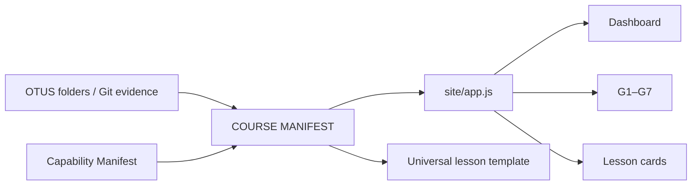

# STEP 02 — Machine-readable Course Manifest

Статус: **IN PROGRESS**

## 1. Цель

Убрать архитектурные данные курса из runtime-кода и сделать один источник данных для Cockpit.

## 2. Нотационная схема

Контракт:

`SOURCE/EVIDENCE → MANIFEST → RENDER → VISUAL → TRACEABILITY`

## 3. Data contract

Файл: `site/data/course-manifest.json`.

Обязательные поля урока:

- `id`
- `title`
- `gate`
- `status`
- `evidence`
- `path`
- `maturity`
- `curriculum`
- `architect_pro`
- `father_production.capability_ids`

## 4. Правило источника истины

`app.js` не хранит список уроков. Он только читает manifest и визуализирует его.

Статус урока не повышается без evidence в Git.

## 5. Связь с STEP 01

Course Manifest ссылается на component/capability IDs из `site/data/capabilities.json`, поэтому каждый урок получает первичную связь с FATHER Production.

## 6. Definition of Done

- создан `course-manifest.json`;
- 31 урок присутствует;
- 7 gates присутствуют;
- каждый урок имеет gate;
- каждый урок имеет maturity;
- production mapping хранится через capability IDs;
- `app.js` больше не содержит hardcoded lesson registry;
- создан визуальный poster;
- создана страница STEP 02;
- запись добавлена в дневник.
