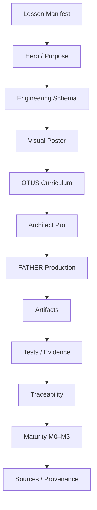

# STEP 03 — Universal Lesson Template

Статус: **DONE v1**

## 1. Цель

Создать единый шаблон страницы, который будет использоваться для всех 31 уроков и не даст смешивать учебную программу, профессиональное расширение и production implementation.

## 2. Обязательная структура страницы

`SCHEMA → VISUAL → OTUS → ARCHITECT PRO → FATHER PRODUCTION → ARTIFACTS → TESTS/EVIDENCE → TRACEABILITY → MATURITY → SOURCES`

## 3. Нотационная схема

## 4. Data contract

Шаблон получает из `course-manifest.json`:

- id/title/gate/status/maturity;
- source path;
- Architect Pro page/state;
- capability IDs.

Дополнительные lesson-specific данные должны храниться отдельно от layout.

## 5. Visual contract

Каждая lesson page имеет:

1. инженерную схему;
2. отдельный визуальный poster/infographic;
3. одну и ту же легенду цветов/форм из STEP 00;
4. подпись STEP / LESSON / maturity;
5. accessible text alternative.

## 6. UX layout

- sticky top navigation;
- Hero;
- схема;
- visual;
- 3-layer switch/sections;
- artifact/evidence cards;
- traceability strip;
- maturity panel;
- sources.

## 7. Definition of Done

- создан reusable template;
- создан visual poster template;
- данные отделены от layout;
- reusable shell проверен на Lesson 01 в fallback-режиме;\n- фактическая миграция Lesson 01 выполняется отдельным STEP 04;
- responsive layout;
- dark/light theme;
- ссылки на Git evidence;
- запись в journal.

## 8. Первый потребитель

**Lesson 01** используется как эталон миграции в STEP 04.

## 9. Реализация

Созданы:

- `site/lesson-template.html` — reusable shell;
- `site/lesson-template.js` — manifest-driven runtime;
- `site/lesson-template.css` — общий layout;
- `site/data/lesson-detail-template.json` — detail contract;
- `site/assets/step-03-universal-lesson-template.svg` — visual poster;
- `site/step-03-lesson-template.html` — страница STEP 03.

## 10. Validation

- layout не содержит реестр конкретных уроков;
- заголовок/status/maturity/capabilities загружаются из course/capability manifests;
- lesson-specific data ищутся в `site/data/lesson-details/NN.json`;
- отсутствующие данные отображаются как `GAP`;
- dark/light theme сохранена;
- структура соответствует STEP 00.

Следующий шаг: **STEP 04 — Lesson 01 normalization**.
