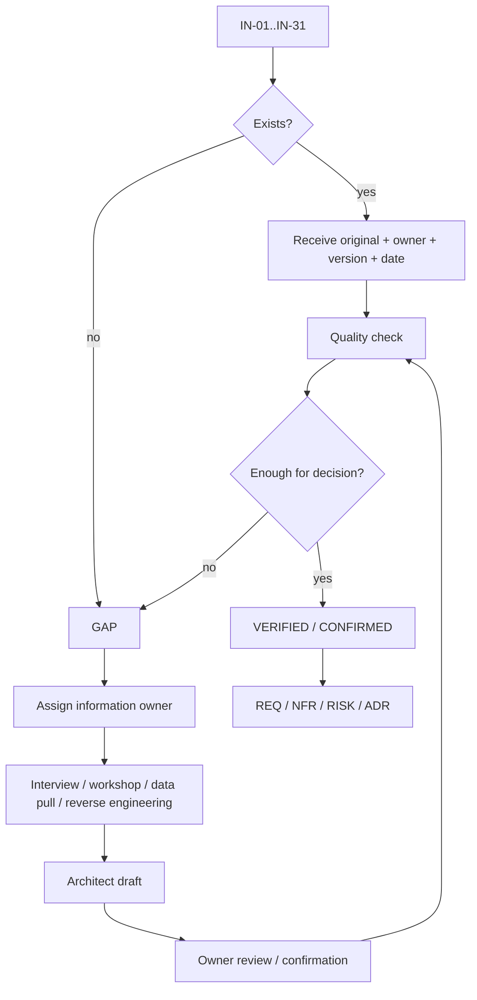

# STEP 04 — Lesson 01 normalization

Статус: **DONE v1**

## 1. Цель

Сделать Lesson 01 эталонным потребителем универсального шаблона STEP 03 без потери уже созданного Architect Intake Pack.

## 2. Источник

Основные факты берутся из:

- `ARCHITECT_INTAKE_PACK.md`;
- `site/lesson-01.html`;
- `site/lesson-01-intake.html`.

Новый слой не заменяет исходники: он нормализует их в data contract сайта.

## 3. Инженерная схема

## 4. Intake workflow

## 5. Production mapping

STEP 04 выявил недостающий production-domain и выпустил amendment STEP 01 v1.1:

- `FTH-INT-001` — Architect Intake Workspace;
- `FTH-REQ-001` — Requirements & Traceability Service;
- `FTH-CTX-001` — Context Builder.

## 6. Статус

Lesson 01 переведён из `materials / M0` в `draft / M1` на основании существующих проверяемых артефактов в Git. Это не означает закрытие G1 или production readiness.

## 7. Definition of Done

- detail manifest создан;
- visual poster создан;
- universal template загружает Lesson 01;
- legacy intake/expert pages сохранены как evidence;
- course manifest ведёт на универсальную страницу;
- production mapping обновлён;
- GAP явно указаны;
- journal обновлён.

## 8. Validation

Проверено:

- Lesson 01 = `draft / M1`;
- `expertPath = ./lesson-template.html?id=1`;
- `FTH-INT-001`, `FTH-REQ-001`, `FTH-CTX-001` существуют;
- detail manifest загружается;
- poster указан;
- legacy pages сохранены;
- 13 артефактов, 4 evidence и 3 GAP отражены явно.

Следующий шаг: **STEP 05 — Lesson 02: проектирование и оценка, риски и смета**.
