# STEP 18 — Lesson 15: AI Observability / SLO / Alerting

Статус: **DONE v1**

> STEP 18 выполнен приоритетно по прямому запросу пользователя. STEP 16–17 (Lessons 13–14) остаются отдельными незакрытыми шагами и будут выполнены позже.

## 1. Цель

Нормализовать Lesson 15 по visual-first pipeline:

`SCHEMA → VISUAL → OTUS → ARCHITECT PRO → FATHER PRODUCTION → ARTIFACTS → EVIDENCE → TRACEABILITY → MATURITY`

## 2. Инженерная схема

```mermaid
flowchart LR
    R[REQUEST] --> A[APP / AGENT / RAG / LLM]
    A --> T[METRICS / LOGS / TRACES]
    T --> C[Prometheus / Loki / Tempo-Jaeger]
    C --> G[Grafana / Analysis]
    G --> S[SLO / Eval / Security / Cost]
    S --> AL[Alert]
    AL --> RB[Runbook / Owner]
    RB --> IR[Incident / RCA]
    IR --> CH[ADR / Fix / Tech Debt]
    CH --> V[Verify]
```

## 3. Source-derived OTUS scope

Подтверждено источником Lesson 15:

- Metrics, Logs, Traces;
- Prometheus, Grafana, Jaeger;
- SLO: latency, error rate, RPS;
- alerting, MTTF, MTTR;
- drift и pipeline monitoring;
- LLM/RAG quality;
- compliance/safety;
- business-metric alerting;
- RCA / 5 Whys;
- Security Layer: PII Sanitizer + Guardrails;
- RAG testing: Faithfulness / Answer Relevancy, Ragas / DeepEval;
- Golden Signals + Token usage + Average Cost per Request.

Учебный статус источника: **не сдано**.

## 4. Existing project evidence

В папке Lesson 15 уже есть:

- `README.md`;
- `LLM_OBSERVABILITY_MATRIX.md`;
- `GRAFANA_DASHBOARDS.md`;
- `OWASP_LLM_TOP10_2026.md`;
- `SOURCES.md`;
- `grafana/llm-observability-dashboard.json`;
- `prometheus/llm-alerts.yml`;
- `alerting-373402-178176.tgz`.

Archive verification confirms a reproducible demo lab with:

- FastAPI ML inference;
- Prometheus metrics;
- Kubernetes Deployment / Service / ServiceMonitor;
- Grafana dashboard;
- load test;
- deliberate error/latency injection;
- topology and dataflow diagrams.

Поэтому engineering maturity повышена до **LAB / M1**, но это не меняет учебный submission status.

## 5. Architect Pro model

### RED + USE + AI

- RED: Rate / Errors / Duration;
- USE: Utilization / Saturation / Errors;
- AI: Tokens / Cost / Quality / Retrieval / Safety / Agency.

### Dashboard families

1. Executive / SLO.
2. LLM runtime.
3. RAG.
4. Agents.
5. Security.

### Mandatory correlation

`metric ↔ log/event ↔ trace span ↔ alert ↔ runbook ↔ incident ↔ change`

## 6. Production mapping

- `FTH-OBS-001 · Observability & Audit Plane`
- `FTH-SLO-001 · SLO, Alerting & Incident Response Service`
- `FTH-EVL-001 · Evaluation Service`
- `FTH-POL-001 · Policy & Security Plane`
- `FTH-FIN-001 · FinOps / Cost Control`
- `FTH-RAG-001 · Retrieval Gateway`
- `FTH-AGT-001 · Agent Zoo`
- `FTH-REL-001 · Reliability Plane`

## 7. New architectural decision

Observability and SLO/Alerting are separate responsibilities:

- `FTH-OBS-001` owns telemetry collection/correlation and audit;
- `FTH-SLO-001` owns SLI/SLO/error budgets, alert rules, routing, runbooks and incident linkage.

Причина: наличие telemetry не означает наличие управляемой эксплуатационной реакции.

## 8. Runbooks

Добавлены:

- `docs/runbooks/llm-high-error-rate.md`
- `docs/runbooks/llm-high-latency.md`
- `docs/runbooks/llm-guardrail-spike.md`

Они соответствуют runbook references в `prometheus/llm-alerts.yml`.

## 9. Visual

- `site/assets/lesson-15-observability-ai.svg`

## 10. Data

- `site/data/lesson-details/15.json`
- universal page: `site/lesson-template.html?id=15`

## 11. GAP

- учебный статус остаётся `not submitted`;
- current Grafana JSON является starter dashboard, не полной production board;
- thresholds в alert rules — учебные и должны быть привязаны к реальным SLO;
- archive lab демонстрирует классический ML service, не полный LLM/RAG/Agent stack;
- automatic eval-to-alert feedback loop ещё не подтверждён runtime evidence.

## 12. Definition of Done — результат

- schema: DONE;
- visual: DONE;
- OTUS layer: DONE;
- Architect Pro: DONE;
- FATHER mapping: DONE;
- dashboard/alerts: EXIST;
- runbooks: DONE;
- lab evidence: VERIFIED;
- traceability: DONE;
- maturity: `LAB / M1`;
- submission: `not submitted`.

Следующее последовательное продолжение после возврата к очереди: **STEP 16 — Lesson 13**.  
Если продолжаем по текущему приоритету уроков пользователя, следующий выбранный Lesson может быть обработан вне очереди с явной записью в journal.

## 13. Course metadata clarification

По уточнённому тексту Lesson 15:

- преподаватель: **Дмитрий Фомин**;
- дата занятия: **21.09.2026**;
- длительность: **90 минут**;
- рекомендуемый срок сдачи: **27.09.2026**.

Критерии статуса «Принято»:

1. Security — учтены Prompt Injection или утечки данных.
2. Metrics — используются AI-quality metrics, а не только CPU/infrastructure load.
3. Tooling — предложены актуальные инструменты: Prometheus, Tempo, Langfuse/LangSmith, Ragas/DeepEval.

Эти критерии теперь хранятся в lesson detail manifest отдельно от engineering maturity.

## 14. Deadline correction

По полному тексту задания, предоставленному пользователем:

- рекомендуемый срок сдачи: **30.09.2026**.

Ранее зафиксированная дата 27.09.2026 считается заменённой.
