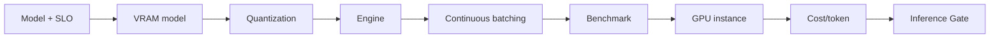

# STEP 20 — Lesson 17: LLM Inference Sizing & Optimization

Статус: **DONE v1 (normalization)**

## Source-derived scope

Lesson 17 source explicitly covers:

- LLM performance analysis;
- VRAM calculation;
- quantization;
- FlashAttention;
- vLLM;
- continuous batching;
- GPU instance selection in Yandex Cloud / Cloud.ru / AWS / Azure;
- Inference Calculator frame.

Преподаватель: **Иван Четвериков**.  
Дата: **28.09.2026**.  
Длительность: **90 минут**.

В папке Lesson 17 найден только source text. Completed calculator/homework artifact не найден.

## Engineering schema

## Architect Pro extension

Формулы ниже добавлены как инженерное расширение, а не как дословный текст урока:

- `Weights VRAM ≈ parameter_count × bits_per_weight / 8`;
- `KV cache ≈ batch × seq × layers × 2 × kv_heads × head_dim × bytes/element`;
- `Runtime VRAM ≈ weights + KV + workspace/activations + headroom`;
- `Latency ≈ queue + prefill + decode + external overhead`;
- `Cost/1M tokens ≈ hourly cost / effective tokens/sec / 3600 × 1e6`.

Final sizing must be validated by benchmark.

## Production decision

Создан:

- `FTH-INF-001 · LLM Inference Optimization Service`.

Responsibilities:

- VRAM model;
- quantization profiles;
- engine profiles;
- FlashAttention / vLLM;
- continuous batching;
- latency/throughput benchmark;
- GPU placement comparison.

## Agent Factory impact

Agent passport now needs an **Inference Profile**:

- model/version;
- parameter count;
- precision/quantization;
- max context;
- KV-cache budget;
- runtime engine;
- batching mode;
- TTFT target;
- p95 latency target;
- tokens/sec benchmark;
- cost-per-token benchmark.

Agent does not hard-code a GPU SKU. Placement is a platform decision based on model + SLO + workload + benchmark + cost.

## Status

Lesson 17 = **draft / M1**.

Evidence boundary:

- source material exists;
- target architecture exists;
- completed Inference Calculator and benchmark evidence are absent.

Следующий production-chain step: IaC / CI/CD / MLOps / Deployment.
