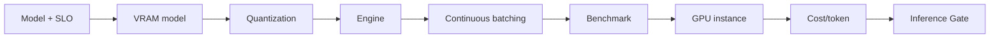

# STEP 20 — Lesson 17: LLM Inference Sizing & Optimization

Статус: **DONE v1 (normalization)**

## Source-derived scope

Lesson 17 source explicitly covers:

- LLM performance analysis;
- VRAM calculation;
- quantization;
- FlashAttention;
- vLLM;
- continuous batching;
- GPU instance selection in Yandex Cloud / Cloud.ru / AWS / Azure;
- Inference Calculator frame.

Преподаватель: **Иван Четвериков**.  
Дата: **28.09.2026**.  
Длительность: **90 минут**.

В папке Lesson 17 найден только source text. Completed calculator/homework artifact не найден.

## Engineering schema

## Architect Pro extension

Формулы ниже добавлены как инженерное расширение, а не как дословный текст урока:

- `Weights VRAM ≈ parameter_count × bits_per_weight / 8`;
- `KV cache ≈ batch × seq × layers × 2 × kv_heads × head_dim × bytes/element`;
- `Runtime VRAM ≈ weights + KV + workspace/activations + headroom`;
- `Latency ≈ queue + prefill + decode + external overhead`;
- `Cost/1M tokens ≈ hourly cost / effective tokens/sec / 3600 × 1e6`.

Final sizing must be validated by benchmark.

## Production decision

Создан:

- `FTH-INF-001 · LLM Inference Optimization Service`.

Responsibilities:

- VRAM model;
- quantization profiles;
- engine profiles;
- FlashAttention / vLLM;
- continuous batching;
- latency/throughput benchmark;
- GPU placement comparison.

## Agent Factory impact

Agent passport now needs an **Inference Profile**:

- model/version;
- parameter count;
- precision/quantization;
- max context;
- KV-cache budget;
- runtime engine;
- batching mode;
- TTFT target;
- p95 latency target;
- tokens/sec benchmark;
- cost-per-token benchmark.

Agent does not hard-code a GPU SKU. Placement is a platform decision based on model + SLO + workload + benchmark + cost.

## Status

Lesson 17 = **draft / M1**.

Evidence boundary:

- source material exists;
- target architecture exists;
- completed Inference Calculator and benchmark evidence are absent.

Следующий production-chain step: IaC / CI/CD / MLOps / Deployment.

## Homework implementation — Llama-3-70B / 1000 RPM

Рекомендуемый срок сдачи: **06.10.2026**.

### Условие

- Llama-3-70B;
- FP16 and INT4;
- 1000 RPM;
- compare A100 / T4 / L4;
- compare Yandex Cloud / Cloud.ru;
- estimate batching / vLLM impact;
- submit Google Sheet + short conclusion.

### Explicit planning assumptions

Условие не задаёт token profile и response time. Для воспроизводимого расчёта они вынесены в editable inputs:

- average input = 512 tokens;
- average output = 128 tokens;
- average E2E = 6 s;
- concurrency ≈ 100;
- headroom = 20%;
- KV dtype = FP16/BF16;
- runtime VRAM reserve = 15%.

### Result

- FP16 weights ≈ **130.39 GiB**;
- INT4 weights ≈ **32.60 GiB**;
- KV cache ≈ **19.53 GiB**;
- INT4 total planning VRAM ≈ **59.95 GiB**;
- required output throughput with headroom ≈ **2560 tok/s**;
- planning configuration: **4×A100 80GB, INT4**.

Memory-fit grid:

| Mode | A100 80GB | T4 16GB | L4 24GB |
|---|---:|---:|---:|
| FP16 | 4* | 11 | 8 |
| INT4 | 1 | 4 | 3 |

* A100 FP16 uses NVIDIA optimized practical profile. T4/L4 are memory-fit only, not throughput recommendations.

### Cloud core-compute comparison

For selected 4×A100:

- Cloud.ru ≈ **1,018,944 ₽ / month**;
- Yandex Cloud ≈ **1,360,426 ₽ / month**;
- Cloud.ru ≈ **25.1% lower** in the compared core-compute tariff.

Disk/network/egress/support/provider-specific extras are outside this comparison.

### Optimization methodology

vLLM/batching savings are not hard-coded.

Sizing is recomputed from measured effective throughput:

- 350 tok/s/GPU → 8 A100;
- 500 → 6;
- 640 → 4;
- 700 → 4;
- 900 → 3.

350→700 tok/s/GPU would therefore reduce core GPU count from 8 to 4 in this workload: approximately 50% compute reduction. This is sensitivity analysis, not a promised vLLM gain.

### Evidence

- `17.../DZ_17_SIZING_REPORT.md`;
- formula-driven XLSX workbook;
- native Google Sheet created;
- Lesson 17 detail manifest contains exact homework/acceptance criteria.

### Acceptance criteria

1. VRAM = Parameters × Weight + KV Cache — covered.
2. Real/near-real provider prices — covered with source and scope.
3. Quantization / optimization understanding — covered; memory reduction and measured-throughput cost sensitivity are separated.

Course submission status remains **not submitted** until the user sends the Google Sheet link to OTUS.
